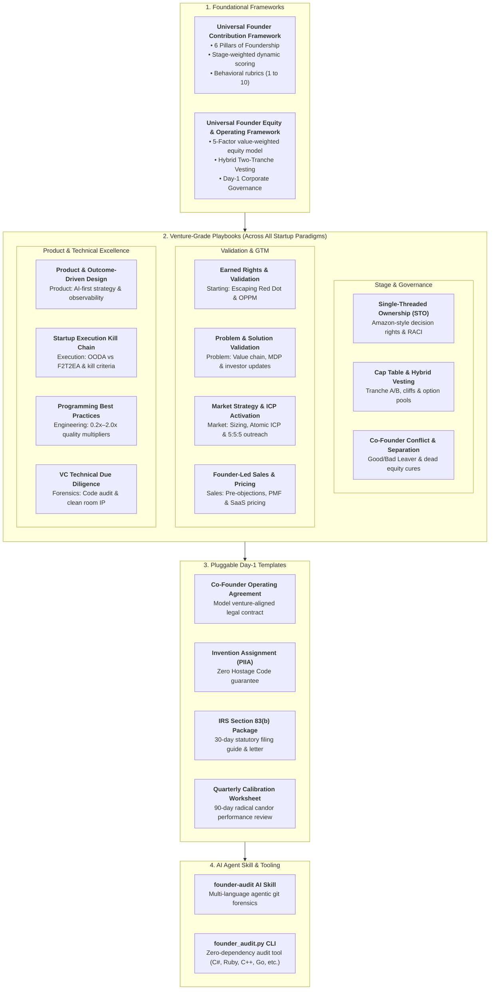

# Universal Founder Framework (UFF)
### An Open-Source Governance, Equity, Accountability & Code Quality Audit Platform for Early-Stage Tech Founders

[](LICENSE)
[](LICENSE)
[](skills/founder-audit/SKILL.md)
[](tools/founder_audit.py)

---

## 1. The Founder Dilemma & Framework Philosophy

Startups rarely die from competitive pressure. They die from **unforced internal failures**:
1. **The Equal Split Fallacy:** Arbitrary 50/50 or 33/33/33 handshakes agreed to over coffee that sow resentment when risk and output diverge.
2. **Consensus Paralysis:** When three people share ownership of a subsystem, **nobody owns it**. Decision velocity slows to a crawl.
3. **The "Vesting in Sleep" Trap:** Traditional 4-year time-only vesting allows underperforming or disengaged co-founders to collect 25% of the company each year while contributing zero real value.
4. **The "90% Finisher" Syndrome (*Hatti Chiryo, Pucchar Adkiyo*):** Easily building the initial prototype, but abandoning the grueling last 10%—automated tests, security compliance, deployment edge cases, and production runbooks.

The **Universal Founder Framework (UFF)** replaces emotional arguments and vague promises with **venture-grade contracts, objective quantitative Git forensics, Single-Threaded Ownership (STO), and AI-assisted audits**.

---

## 2. Architecture of the Framework



---

## 3. Directory Tour & What's Inside

| Directory / File | Paradigm / Scope | Description & Purpose |
| :--- | :--- | :--- |
| **[`frameworks/universal-founder-contribution-framework.md`](frameworks/universal-founder-contribution-framework.md)** | **Core OS** | The **6 Pillars of Foundership** (Vision, Technical Mastery, 100% Finisher, High Agency, Leadership, Commercial Scoping), stage weights, and behavioral scoring anchors. |
| **[`frameworks/universal-founder-equity-and-operating-framework.md`](frameworks/universal-founder-equity-and-operating-framework.md)** | **Core OS** | Mathematical **5-Factor Dynamic Equity Model**, milestone-driven two-tranche hybrid vesting, and legal hygiene. |
| **[`playbooks/single-threaded-ownership.md`](playbooks/single-threaded-ownership.md)** | **Governance** | Eliminating consensus drag, Amazon Type 1 vs Type 2 decisions, RACI assignments, and the 24-hour review SLA. |
| **[`playbooks/cap-table-and-vesting.md`](playbooks/cap-table-and-vesting.md)** | **Governance** | Cap table modeling, 15–20% unallocated ESOP reserve, Tranche A runway vs Tranche B milestone triggers, and double-trigger acceleration. |
| **[`playbooks/co-founder-conflict-resolution.md`](playbooks/co-founder-conflict-resolution.md)** | **Governance** | Resolving dysfunction early, Good Leaver vs Bad Leaver provisions, company share repurchase options, and curing "dead equity." |
| **[`playbooks/earned-rights-and-venture-validation.md`](playbooks/earned-rights-and-venture-validation.md)** | **Starting** | **The Earned Rights Principle**: Escaping the "Red Dot", OPPM (One Page Project Manager), extreme uncertainty decision matrix, conative founder instincts, and becoming **Mission-Critical Core**. |
| **[`playbooks/problem-and-solution-validation.md`](playbooks/problem-and-solution-validation.md)** | **Problem** | Hunting acute agony, Startup Value Chain mapping, Solution First Glance stress-testing, **Minimum Delightful Product (MDP)** loops, the 5 Pillars of user journey, and advisory boards. |
| **[`playbooks/market-strategy-and-icp-activation.md`](playbooks/market-strategy-and-icp-activation.md)** | **Market** | Bottom-up TAM/SAM/SOM sizing, Porter's 5 forces & 7 entry barriers, **Atomic ICP (6 parts)**, **5:5:5 Cold Discovery Outreach**, Red vs Blue Ocean (ERRC matrix), and 14-day MVO smoke tests. |
| **[`playbooks/product-strategy-and-outcome-driven-design.md`](playbooks/product-strategy-and-outcome-driven-design.md)** | **Product** | **Outcome-Driven Design (ODD)**, AI-first architecture & data flywheels, **The 7 Tech Commandments**, full-stack observability, the Golden Handshake onboarding, and startup pivot mechanics. |
| **[`playbooks/founder-led-sales-and-pricing.md`](playbooks/founder-led-sales-and-pricing.md)** | **Sales** | 20 daily outbound touches, discovery-to-paid pipeline stages, **Sales Pre-Objections Framework**, Month-2 PMF retention benchmarks, PLG loops, and value-based SaaS pricing. |
| **[`playbooks/startup-execution-kill-chain.md`](playbooks/startup-execution-kill-chain.md)** | **Execution** | **OODA vs F2T2EA**, the 6 links of the startup kill chain, eliminating the "half-loop" motion theater, pre-commit milestone kill gates, and the fractal operating rhythm. |
| **[`playbooks/programming-best-practices-and-impact-evaluation.md`](playbooks/programming-best-practices-and-impact-evaluation.md)** | **Engineering** | **Qualitative Architectural Paradigms**: KISS, DDD layered boundaries, default-deny security, 100% finisher standards, and the **$0.2\times$ to $2.0\times$ Quality Multiplier**. |
| **[`playbooks/technical-due-diligence.md`](playbooks/technical-due-diligence.md)** | **Forensics** | What top VCs and CTO diligence partners inspect: code health, architecture, security rules, and clean room licensing. |
| **[`templates/co-founder-operating-agreement.md`](templates/co-founder-operating-agreement.md)** | **Legal** | Pluggable, ready-to-sign co-founder operating contract with hybrid vesting and STO provisions. |
| **[`templates/invention-assignment-piia.md`](templates/invention-assignment-piia.md)** | **Legal** | Proprietary Information & Inventions Agreement ensuring corporate ownership and "Zero Hostage Code." |
| **[`templates/section-83b-election-template.md`](templates/section-83b-election-template.md)** | **Legal** | Model IRS 83(b) election form, certified mail cover letter, and 30-day tracking guide. |
| **[`templates/quarterly-founder-calibration.md`](templates/quarterly-founder-calibration.md)** | **Legal** | 90-day Founder Calibration Review (FCR) sheet for peer calibration and milestone verification. |
| **[`skills/founder-audit/SKILL.md`](skills/founder-audit/SKILL.md)** | **Tooling** | Drop-in AI agent skill for Antigravity, Claude Code, Cursor, and Copilot to autonomously audit multi-language codebases. |
| **[`tools/founder_audit.py`](tools/founder_audit.py)** | **Tooling** | Standalone, zero-dependency Python CLI tool supporting .NET, Ruby, C++, Java, Go, Python, Rust, PHP, Swift, and more. |

---

## 4. Quickstart: 5 Steps to Venture-Grade Founder Governance

### Step 1: Execute Day-1 Legal Hygiene
Before authoring proprietary code or taking investor capital:
1. Complete and sign the **[Co-Founder Operating Agreement](templates/co-founder-operating-agreement.md)**.
2. Sign the **[Invention Assignment Agreement (PIIA)](templates/invention-assignment-piia.md)** to ensure 100% of IP, repositories, and domains belong to the company ("Zero Hostage Code").
3. File your **[IRS Section 83(b) Election](templates/section-83b-election-template.md)** via USPS Certified Mail within **exactly 30 calendar days** of share issuance.

### Step 2: Establish Single-Threaded Ownership (STO)
Assign exactly one founder as Accountable ($A$) for each subsystem using our **[STO Playbook](playbooks/single-threaded-ownership.md)**:
* CTO / Technical Co-Founder: Architecture, database models, security, and SRE.
* CEO / Commercial Co-Founder: Customer pilots, pricing, revenue, and fundraising.
* COO / Domain Co-Founder: Regulatory compliance, field operations, and domain workflows.

### Step 3: Implement Hybrid Two-Tranche Vesting
Structure founder equity into two distinct buckets:
* **Tranche A (60%):** Standard 48-month runway vesting with a 12-month cliff.
* **Tranche B (40%):** Performance vesting gated by objective business deliverables (v1.0 production launch, first 3 paid pilots, institutional seed closing).

### Step 4: Run the 90-Day Founder Calibration Review (FCR)
Every quarter, founding teams convene for a structured calibration using the **[Quarterly Calibration Worksheet](templates/quarterly-founder-calibration.md)**:
* Review quantitative surviving code metrics using the CLI audit tool.
* Score qualitative performance against the 6 Pillars of Foundership.
* Formally sign off on completed Tranche B milestones.

---

## 5. Automated Forensics: Running the CLI Audit Tool

The repository includes a universal, standalone Python tool (`tools/founder_audit.py`) that runs `git blame` and commit log forensics across one or more repositories without any external dependencies.

### Basic Usage:
```bash
# Audit a single local repository
python tools/founder_audit.py --repos . --output audit-report.md

# Audit multiple ecosystem repositories simultaneously
python tools/founder_audit.py --repos ../frontend ../backend ../infra --output master-audit.md --json master-audit.json
```

### Using a Configuration File:
Copy `tools/founder-audit.config.example.json` and configure author aliases to map personal emails, GitHub handles, and machine hostnames to canonical founder identities:
```bash
python tools/founder_audit.py --config my-startup.config.json
```

### Generated Outputs:
1. **Markdown Audit Report (`audit-report.md`):** Executive summary, surviving production lines table, subsystem STO breakdown, and per-repo commit distributions.
2. **JSON Telemetry Artifact (`audit-report.json`):** Machine-readable payload for CI/CD pipelines, investor data rooms, or executive dashboards.

---

## 6. AI Agent Integration: The `founder-audit` Skill

Modern AI coding agents (such as Google Antigravity, Claude Code, or Cursor) can act as an objective, neutral third party during founder calibrations and technical due diligence.

### How to Use with AI Agents:
1. Load or reference [`skills/founder-audit/SKILL.md`](skills/founder-audit/SKILL.md) in your AI assistant's context.
2. Prompt the AI agent:
   > *"Run a founder contribution and code quality audit across all active repositories in my workspace. Map surviving lines of code to our founders, check subsystem single-threaded ownership, and prepare a 6-Pillar evaluation scorecard for our upcoming quarterly calibration."*
3. The AI agent will discover the repositories, inspect Git blame, synthesize qualitative PR evidence, and generate an audit report formatted to the Universal Founder Framework standards.

---

## 7. Open Source Licensing & Community Contributions

This framework is maintained by startup founders, technical architects, and venture advisors to empower early-stage entrepreneurs worldwide.

* **Documentation & Legal Templates:** Licensed under the **[Creative Commons Attribution 4.0 International License (CC BY 4.0)](LICENSE)**. You are free to share and adapt the material with appropriate attribution.
* **Source Code, AI Skills & CLI Tools:** Licensed under the **[MIT License](LICENSE)**.

### Contributing:
Pull requests, additional playbooks, regulatory translations, and new audit heuristics are welcome. Please open an issue or submit a PR following standard GitHub flow.

---

*Build with urgency. Finish completely. Elevate the bar.*
