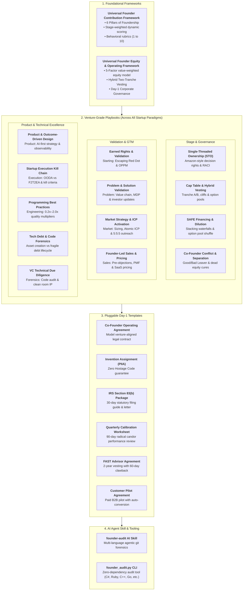

# Universal Founder Framework (UFF)
### An Open-Source Governance, Equity, Accountability & Code Quality Audit Platform for Early-Stage Tech Founders

[](LICENSE)
[](LICENSE)
[](skills/founder-audit/SKILL.md)
[](tools/founder_audit.py)

---

## 1. The Founder Dilemma & Framework Philosophy

Startups rarely die from competitive pressure. They die from **unforced internal failures**:
1. **The Equal Split Fallacy:** Arbitrary 50/50 or 33/33/33 handshakes agreed to over coffee that sow resentment when risk and output diverge.
2. **Consensus Paralysis:** When three people share ownership of a subsystem, **nobody owns it**. Decision velocity slows to a crawl.
3. **The "Vesting in Sleep" Trap:** Traditional 4-year time-only vesting allows underperforming or disengaged co-founders to collect 25% of the company each year while contributing zero real value.
4. **The "90% Finisher" Syndrome (*Hatti Chiryo, Pucchar Adkiyo*):** Easily building the initial prototype, but abandoning the grueling last 10%—automated tests, security compliance, deployment edge cases, and production runbooks.
5. **The Scarcity Delusion (Treating All Contributions as Equally Replaceable):** Failing to differentiate between irreplaceable capabilities that cannot be outsourced (core technical architecture, 100x scalability, pivot adaptability) and hireable skills that can be augmented via specialist consultants or advisory councils.

The **Universal Founder Framework (UFF)** anchors all governance to the **Economic Scarcity Principle (Irreplaceability vs. Hireability)**, replacing emotional arguments and vague promises with **venture-grade contracts, objective quantitative Git forensics, Single-Threaded Ownership (STO), and AI-assisted audits**.

---

## 2. Architecture of the Framework



---

## 3. Directory Tour & What's Inside

| Directory / File | Paradigm / Scope | Description & Purpose |
| :--- | :--- | :--- |
| **[`frameworks/universal-founder-contribution-framework.md`](frameworks/universal-founder-contribution-framework.md)** | **Core OS** | Executive Philosophy, **The Weighting Rationale (Irreplaceability vs. Hireability)**, the **6 Pillars of Foundership**, dynamic stage weights, and behavioral scoring anchors. |
| **[`frameworks/universal-founder-equity-and-operating-framework.md`](frameworks/universal-founder-equity-and-operating-framework.md)** | **Core OS** | Mathematical **5-Factor Dynamic Equity Model** anchored to Economic Scarcity, milestone-driven two-tranche hybrid vesting, and Day-1 legal hygiene. |
| **[`playbooks/single-threaded-ownership.md`](playbooks/single-threaded-ownership.md)** | **Governance** | Eliminating consensus drag, Amazon Type 1 vs Type 2 decisions, RACI assignments, and the 24-hour review SLA. |
| **[`playbooks/cap-table-and-vesting.md`](playbooks/cap-table-and-vesting.md)** | **Governance** | Cap table modeling, 15–20% unallocated ESOP reserve, Tranche A runway vs Tranche B milestone triggers, and double-trigger acceleration. |
| **[`playbooks/safe-financing-and-dilution.md`](playbooks/safe-financing-and-dilution.md)** | **Governance** | **SAFE Financing & Cap Table Dilution**: Post-money SAFE stacking waterfalls, the "option pool shuffle" trap, and the 15% pre-priced dilution ceiling. |
| **[`playbooks/co-founder-conflict-resolution.md`](playbooks/co-founder-conflict-resolution.md)** | **Governance** | Resolving dysfunction early, Good Leaver vs Bad Leaver provisions, company share repurchase options, and curing "dead equity." |
| **[`playbooks/earned-rights-and-venture-validation.md`](playbooks/earned-rights-and-venture-validation.md)** | **Starting** | **The Earned Rights Principle**: Escaping the "Red Dot", OPPM (One Page Project Manager), extreme uncertainty decision matrix, conative founder instincts, and becoming **Mission-Critical Core**. |
| **[`playbooks/problem-and-solution-validation.md`](playbooks/problem-and-solution-validation.md)** | **Problem** | Hunting acute agony, Startup Value Chain mapping, Solution First Glance stress-testing, **Minimum Delightful Product (MDP)** loops, the 5 Pillars of user journey, and advisory boards. |
| **[`playbooks/market-strategy-and-icp-activation.md`](playbooks/market-strategy-and-icp-activation.md)** | **Market** | Bottom-up TAM/SAM/SOM sizing, Porter's 5 forces & 7 entry barriers, **Atomic ICP (6 parts)**, **5:5:5 Cold Discovery Outreach**, Red vs Blue Ocean (ERRC matrix), and 14-day MVO smoke tests. |
| **[`playbooks/product-strategy-and-outcome-driven-design.md`](playbooks/product-strategy-and-outcome-driven-design.md)** | **Product** | **Outcome-Driven Design (ODD)**, AI-first architecture & data flywheels, **The 7 Tech Commandments**, full-stack observability, the Golden Handshake onboarding, and startup pivot mechanics. |
| **[`playbooks/founder-led-sales-and-pricing.md`](playbooks/founder-led-sales-and-pricing.md)** | **Sales** | 20 daily outbound touches, discovery-to-paid pipeline stages, **Sales Pre-Objections Framework**, Month-2 PMF retention benchmarks, PLG loops, and value-based SaaS pricing. |
| **[`playbooks/startup-execution-kill-chain.md`](playbooks/startup-execution-kill-chain.md)** | **Execution** | **OODA vs F2T2EA**, the 6 links of the startup kill chain, eliminating the "half-loop" motion theater, pre-commit milestone kill gates, and the fractal operating rhythm. |
| **[`playbooks/programming-best-practices-and-impact-evaluation.md`](playbooks/programming-best-practices-and-impact-evaluation.md)** | **Engineering** | **Qualitative Architectural Paradigms**: KISS, DDD layered boundaries, default-deny security, 100% finisher standards, and the **$0.2\times$ to $2.0\times$ Quality Multiplier**. |
| **[`playbooks/technical-debt-lifecycle-and-code-forensics.md`](playbooks/technical-debt-lifecycle-and-code-forensics.md)** | **Engineering** | **Technical Debt Lifecycle & Code Forensics**: Distinguishing visual prototype drag from architectural asset creation, direct DB coupling traps, and refactoring survival ratios. |
| **[`playbooks/technical-due-diligence.md`](playbooks/technical-due-diligence.md)** | **Forensics** | What top VCs and CTO diligence partners inspect: code health, architecture, security rules, and clean room licensing. |
| **[`templates/co-founder-operating-agreement.md`](templates/co-founder-operating-agreement.md)** | **Legal** | Pluggable, ready-to-sign co-founder operating contract with hybrid vesting and STO provisions. |
| **[`templates/invention-assignment-piia.md`](templates/invention-assignment-piia.md)** | **Legal** | Proprietary Information & Inventions Agreement ensuring corporate ownership and "Zero Hostage Code." |
| **[`templates/section-83b-election-template.md`](templates/section-83b-election-template.md)** | **Legal** | Model IRS 83(b) election form, certified mail cover letter, and 30-day tracking guide. |
| **[`templates/quarterly-founder-calibration.md`](templates/quarterly-founder-calibration.md)** | **Legal** | 90-day Founder Calibration Review (FCR) sheet for peer calibration and milestone verification. |
| **[`templates/fast-advisor-agreement.md`](templates/fast-advisor-agreement.md)** | **Legal** | **Founder Advisor Standard Agreement (FAST)**: 24-month vesting, 3-month cliff, quarterly contribution triggers, and 60-day non-responsiveness clawback. |
| **[`templates/customer-pilot-agreement.md`](templates/customer-pilot-agreement.md)** | **Legal** | **B2B SaaS Customer Pilot Agreement**: Paid evaluation parameters, objective quantitative success criteria, and automatic conversion into annual MSA. |
| **[`skills/founder-audit/SKILL.md`](skills/founder-audit/SKILL.md)** | **Tooling** | Drop-in AI agent skill for forensic multi-repo Git codebase audits, surviving lines, and 6-Pillar scorecard calibration. |
| **[`skills/founder-advisor/SKILL.md`](skills/founder-advisor/SKILL.md)** | **Tooling** | Drop-in AI agent skill for on-demand founder advisory across equity splits, customer validation, SaaS pricing, and conflict resolution. |
| **[`skills/equity-calculator/SKILL.md`](skills/equity-calculator/SKILL.md)** | **Tooling** | Drop-in AI agent skill for automated 5-Factor Dynamic Equity, Demmler's Pie, and Post-Money SAFE dilution waterfalls. |
| **[`tools/founder_audit.py`](tools/founder_audit.py)** | **Tooling** | Standalone, zero-dependency Python CLI tool supporting .NET, Ruby, C++, Java, Go, Python, Rust, PHP, Swift, and more. |
| **[`tools/equity_calculator.py`](tools/equity_calculator.py)** | **Tooling** | Standalone, zero-dependency Python CLI tool for 5-Factor dynamic equity, Demmler's Pie, and SAFE cap table modeling. |

---

## 4. Quickstart: 5 Steps to Venture-Grade Founder Governance

### Step 1: Execute Day-1 Legal Hygiene
Before authoring proprietary code or taking investor capital:
1. Complete and sign the **[Co-Founder Operating Agreement](templates/co-founder-operating-agreement.md)**.
2. Sign the **[Invention Assignment Agreement (PIIA)](templates/invention-assignment-piia.md)** to ensure 100% of IP, repositories, and domains belong to the company ("Zero Hostage Code").
3. File your **[IRS Section 83(b) Election](templates/section-83b-election-template.md)** via USPS Certified Mail within **exactly 30 calendar days** of share issuance.

### Step 2: Establish Single-Threaded Ownership (STO)
Assign exactly one founder as Accountable ($A$) for each subsystem using our **[STO Playbook](playbooks/single-threaded-ownership.md)**:
* CTO / Technical Co-Founder: Architecture, database models, security, and SRE.
* CEO / Commercial Co-Founder: Customer pilots, pricing, revenue, and fundraising.
* COO / Domain Co-Founder: Regulatory compliance, field operations, and domain workflows.

### Step 3: Implement Hybrid Two-Tranche Vesting
Structure founder equity into two distinct buckets:
* **Tranche A (60%):** Standard 48-month runway vesting with a 12-month cliff.
* **Tranche B (40%):** Performance vesting gated by objective business deliverables (v1.0 production launch, first 3 paid pilots, institutional seed closing).

### Step 4: Run the 90-Day Founder Calibration Review (FCR)
Every quarter, founding teams convene for a structured calibration using the **[Quarterly Calibration Worksheet](templates/quarterly-founder-calibration.md)**:
* Review quantitative surviving code metrics using the CLI audit tool.
* Score qualitative performance against the 6 Pillars of Foundership.
* Formally sign off on completed Tranche B milestones.

---

## 5. Automated Computational & Forensic Tooling

The framework includes two standalone, zero-dependency Python tools that execute immediately in any terminal or agent environment:

### Tool 1: Multi-Repo Codebase & Git Audit (`tools/founder_audit.py`)
Runs `git blame` and commit log forensics across one or more repositories in any language (.NET, Ruby, C++, Java, Go, Python, Rust, PHP, TS):
```bash
# Audit a single local repository
python tools/founder_audit.py --repos . --output audit-report.md

# Audit multiple ecosystem repositories simultaneously
python tools/founder_audit.py --repos ../frontend ../backend ../infra --output master-audit.md --json master-audit.json

# Use author alias configuration mapping
python tools/founder_audit.py --config tools/founder-audit.config.example.json
```

### Tool 2: Dynamic Equity & SAFE Dilution Calculator (`tools/equity_calculator.py`)
Calculates objective 5-Factor Dynamic Equity splits, Demmler's Pie, and Post-Money SAFE waterfalls:
```bash
# 5-Factor Dynamic Equity Split (scores 1-10 across 5 economic scarcity factors)
python tools/equity_calculator.py --mode dynamic --founders "Alice:9,8,7,6,8" "Bob:5,10,8,9,6" --esop 15

# Carnegie Mellon Demmler's Founder's Pie
python tools/equity_calculator.py --mode demmler --founders "Alice:10,8,7,9,8" "Bob:6,9,9,10,7" --esop 15

# Post-Money SAFE Stacking & Pre-Series A Option Pool Shuffle
python tools/equity_calculator.py --mode safe --safes "500000:5000000" "1000000:10000000" --esop 15 --series-a "5000000:25000000"

# Interactive demonstration of all 3 models
python tools/equity_calculator.py --demo
```

---

## 6. AI Agent Integration: Pluggable Skills Suite

Modern AI coding agents (such as Google Antigravity, Claude Code, Cursor, or GitHub Copilot) can load our drop-in skills to act as an objective, neutral third party during founder calibrations, strategy sessions, and diligence reviews:

| AI Skill | Path | Description & Example Trigger |
|---|---|---|
| **`founder-audit`** | [`skills/founder-audit/SKILL.md`](skills/founder-audit/SKILL.md) | **Forensic Code Audit:** *"Audit surviving code ownership and commit churn across our repositories and generate a 6-Pillar scorecard for our quarterly calibration."* |
| **`founder-advisor`** | [`skills/founder-advisor/SKILL.md`](skills/founder-advisor/SKILL.md) | **Strategic Co-Pilot:** *"How should we price our B2B SaaS pilot, handle customer pricing objections, and set up single-threaded ownership so co-founders don't clash?"* |
| **`equity-calculator`** | [`skills/equity-calculator/SKILL.md`](skills/equity-calculator/SKILL.md) | **Cap Table Modeling:** *"Calculate our co-founder equity split using the 5-Factor Dynamic model, and model our dilution if we take \$1M on a \$10M post-money SAFE."* |

---

## 7. Acknowledgements & Source Attribution

The Universal Founder Framework synthesizes battle-tested startup methodologies into open-source governance playbooks, mathematical equity models, and automated engineering audit tools. We believe in radical intellectual honesty and giving full, unambiguous credit to our sources:

* **Primary Modern Frameworks Source:** Many of the startup stage paradigms across our playbooks—including *Earn The Right*, *Problem Impact Analysis*, *Startup Value Chain*, *Atomic ICP*, *5:5:5 Cold Outreach*, *Outcome-Driven Design*, *Tech Commandments*, *Observability Stack*, *SaaS Pricing Strategy*, and *The Kill Chain of Startup Execution*—originate from the comprehensive framework library created by **James Sinclair** at **[Startup to Scaleup](https://www.startuptoscaleup.com/)** ([`startuptoscaleup.com/startup-frameworks/`](https://www.startuptoscaleup.com/startup-frameworks/)). We encourage founders to explore James Sinclair's original visual guides, coaching resources, and publications.
* **Classical Strategy & Governance Literature:** We also draw from foundational thinkers: Col. John Boyd (*OODA Loop*), W. Chan Kim & Renée Mauborgne (*Blue Ocean Strategy & ERRC*), Sean Ellis (*Product-Market Fit 40% Benchmark*), Michael E. Porter (*Five Competitive Forces*), Clark A. Campbell (*One Page Project Manager*), and Jeff Bezos / Amazon (*Single-Threaded Leadership & Type 1/2 Decisions*).

For a complete index of all cited modules and canonical links, see **[`ATTRIBUTION.md`](ATTRIBUTION.md)**.

---

## 8. Open Source Licensing & Community Contributions

This framework is maintained by startup founders, technical architects, and venture advisors to empower early-stage entrepreneurs worldwide.

* **Documentation & Legal Templates:** Licensed under the **[Creative Commons Attribution 4.0 International License (CC BY 4.0)](LICENSE)**. You are free to share and adapt the material with appropriate attribution.
* **Source Code, AI Skills & CLI Tools:** Licensed under the **[MIT License](LICENSE)**.

### Contributing:
Pull requests, additional playbooks, regulatory translations, and new audit heuristics are welcome. Please open an issue or submit a PR following standard GitHub flow.

---

*Build with urgency. Finish completely. Elevate the bar.*
