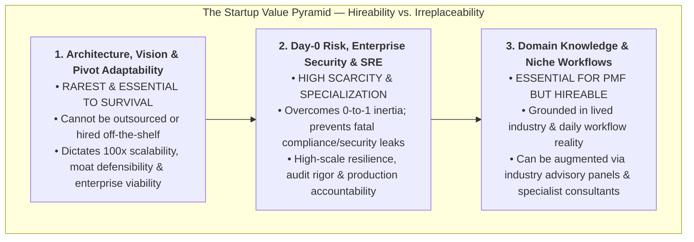
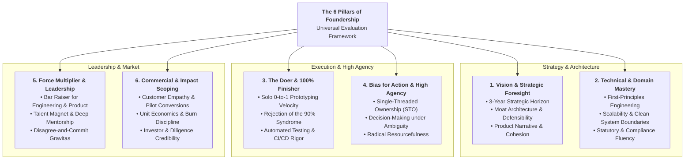
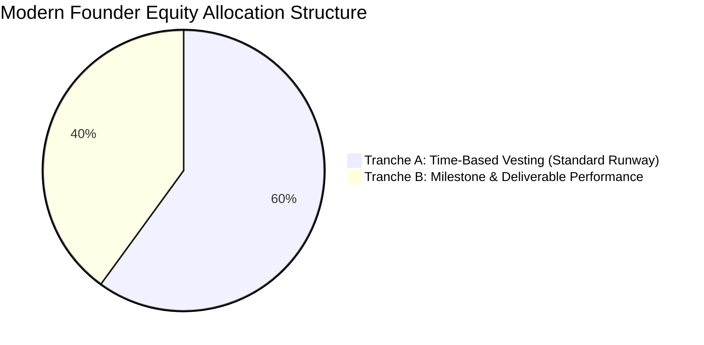

# Universal Founder Contribution & Leadership Framework (UFCF)
### An Open-Source Operating System for Startup Co-Founders

> **License:** Creative Commons Attribution 4.0 International (CC BY 4.0)  
> **Audience:** Early-Stage Startup Founders, Co-Founders, Board Advisors, Accelerators, and Venture Investors  
> **Companion Blueprint:** [Universal Founder Equity & Operating Framework (UEOF)](./universal-founder-equity-and-operating-framework.md)  
> **Source Attributions:** See [ATTRIBUTION.md](../ATTRIBUTION.md) for full citations of foundational literature and modern framework libraries.  
> **Status:** Open Community Framework & Operating Blueprint  
> **Purpose:** Eliminate ambiguity, align equity with value creation, establish Single-Threaded Ownership (STO), and provide an objective standard for evaluating founder impact.

---

## 1. Executive Philosophy: Why This Framework Exists

In early-stage technology startups—particularly in high-liability, heavily regulated spaces like healthcare B2B SaaS (HIPAA 45 CFR §164), FinTech (PCI/SOC 2), or mission-critical enterprise systems—equity splits and executive titles cannot be allocated based on casual handshake agreements, equal thirds, or personal sentiment. 

Startups face existential failure when:
1. **The Equal Split Fallacy:** Arbitrarily dividing equity 50/50 or 33/33 on Day 1 based on optimism rather than demonstrated commitment, unique capabilities, and long-term risk absorption.
2. **Activity is Mistaken for Achievement:** Adding 1,000 lines of brittle code that creates 50 regression bugs and fails audit checks is a net liability, not a contribution. Real enterprise value is measured in resilient architecture, shipped production code, closed enterprise pilots, and institutional capital raised.
3. **Initiation is Divorced from Completion (*"Hatti Chiryo, Pucchar Adkiyo"*):** Starting ten features without finishing any leaves the company stranded. A team member easily builds the initial 80–90% prototype but repeatedly stalls on the grueling last 10%—writing automated tests, resolving production edge cases, passing compliance audits, hardening security, and deploying to production. A deliverable is only complete when it is typed, tested, secure, and deployed to paying users.
4. **The "Employee Mindset" Co-Founder:** Waiting for instructions or a Jira card rather than autonomously taking single-threaded ownership of an entire problem domain end-to-end.
5. **Inability to Adapt When the Roadmap Pivots:** Initial domain knowledge provides early product grounding, but startups evolve rapidly. A founder who cannot adapt when the product roadmap expands beyond their original niche becomes an operational bottleneck.

### 1.2 Foundational Lineage & Core Creed
This framework synthesizes the empirical principles of **Y Combinator (Dynamic Equity & Future Value)**, **Frank Demmler's Founder's Pie Calculator (Carnegie Mellon)**, **Mike Moyer's Slicing Pie (Risk-Adjusted Contributions)**, and **Amazon's Single-Threaded Leadership**:
* **Equity must be earned, not just awaited.** Time-based vesting alone enables "vesting in sleep." True startup equity reflects **sustained value creation, execution speed, and disproportionate responsibility**.
* **High agency is non-negotiable.** Founders do not wait for consensus, permission, or a task assignment. They identify what needs to be done, take calculated risks, and build momentum.
* **Single-Threaded Ownership beats committee consensus.** Shared ownership of a problem means nobody owns it. Every critical system must have one accountable owner with clear decision rights.

---

## 2. The Weighting Rationale: Irreplaceability vs. Hireability

A fundamental error in early startups is treating all contributions as equally valuable or equally hard to replace. The Universal Founder Framework weights evaluation categories based on the **Economic Scarcity Principle (Irreplaceability vs. Hireability)**:



### 2.1 The Economic Scarcity Principle Explained

| Layer of the Pyramid | Scarcity & Replaceability Tier | Strategic & Economic Justification |
| :--- | :---: | :--- |
| **Apex: Architecture, Vision & Pivot Adaptability** | **Rarest / Irreplaceable** | **Survival & 100x Leverage:** Early-stage startups face constant fog of war. The ability to architect scalable systems from first principles, anticipate technical failure modes 24 months early, and rapidly master new problem spaces when the company pivots cannot be hired from an agency or outsourced. A flaw here is fatal to the entire company. |
| **Mid-Tier: Day-0 Risk, Enterprise Security & SRE** | **High Scarcity / High Specialization** | **Overcoming Zero-to-One Inertia:** Stepping into the void solo, incorporating the company, funding initial runway out-of-pocket, and establishing automated security/compliance controls (HIPAA, SOC 2, KMS HSM, tenant boundaries). It requires specialized expertise and skin-in-the-game that salaried contractors will never provide. |
| **Base: Domain Knowledge & Frontline Workflows** | **Essential for PMF, but Hireable** | **Frontline Grounding:** Understanding the practical, daily pain points of end-users (e.g., healthcare caregivers, logistics dispatchers, accountants) is critical to building intuitive workflows and early traction. However, pure domain insight can be augmented or acquired through advisory councils, expert interviews, and clinical/industry consultants. |

---

## 3. The 6 Pillars of Foundership

The Universal Founder Contribution Framework evaluates co-founders across **six fundamental dimensions**:



---

### Pillar 1: Vision & Strategic Foresight (The Pioneer)
*Can this founder see around corners and define where the company must win 2 to 3 years before the market catches on?*

* **3-Year Strategic Horizon:** Synthesizes customer pain points, market shifts, emerging technologies, and regulatory changes into a compelling, executable product roadmap.
* **The Earned Rights Discipline:** Rejects premature scaling. Understands that startup progression is a strict ladder of earned milestones: earning the right to build through proof, earning the right to sell through delivery, and earning the right to scale through retention.
* **Moat Architecture:** Focuses development on compounding defensibility—data network effects, architectural proprietary advantages, switching costs, and regulatory compliance barriers.
* **Narrative & Framing:** Distills complex technical problems into crisp, inspiring narratives that attract top-tier talent, early design partners, and venture investors.
* **Product Cohesion:** Prevents fragmented, feature-creep development; ensures every shipped feature reinforces the company's core value proposition.

---

### Pillar 2: In-Depth Technical & Domain Mastery (The Authority)
*Does this founder possess deep, first-principles mastery over the problem space and the technical machinery required to solve it?*

* **First-Principles Problem Solving:** Rejects superficial stack-overflow copying or blind framework adoption; designs systems grounded in fundamental computer science, unit economics, or domain laws.
* **Architectural Rigor:** Designs decoupled, scalable, and secure systems with clear domain boundaries, avoiding brittle monoliths or premature distributed complexity.
* **Regulatory & Industry Domain Fluency:** Deeply understands the statutory, compliance, or operational nuances of the industry (e.g., HIPAA/HITECH in Healthcare, SOC 2/PCI in FinTech, EVV in Workforce Management).
* **Technical Debt Awareness:** Knows precisely when to take on deliberate technical debt to test market appetite and when to halt and refactor to protect system stability.

---

### Pillar 3: The Doer & "100% Finisher" (The Execution Engine)
*Does this founder relentlessly convert ideas into battle-tested, production reality—closing the last 10% that everyone else abandons?*

* **Zero-to-One Prototyping Speed:** Capable of sitting down solo and building the initial functional prototype, architectural proof-of-concept, or commercial pipeline from scratch.
* **Rejection of the "90% Trap":** Refuses to celebrate until code is running in production, automated test suites pass, documentation is written, and end-users are successfully using it.
* **Obsession with Details & Reliability:** Proactively hunts edge cases, race conditions, concurrency bottlenecks, and UI friction points before customers report them.
* **Production Deployment Rigor:** Treats CI/CD pipelines, automated security scanners, container builds, and operational runbooks as core product deliverables, not post-launch afterthoughts.

---

### Pillar 4: Bias for Action & High Agency (The Driver)
*Does this founder move fast with conviction, ask for forgiveness rather than permission, and refuse to be blocked by ambiguity?*

* **Leader vs. Follower Mindset:** Never waits to be told what to do. Automatically scans the landscape, identifies the critical bottleneck, and begins executing immediately.
* **Calculated Risk-Taking under Ambiguity:** Operates with high conviction when only 70% of the information is available (*Jeff Bezos Type 2 decision principle*).
* **Radical Resourcefulness:** When blocked by a lack of tools, budget, or personnel, invents novel pathways to achieve the outcome anyway.
* **Uncompromising Urgency:** Operates with a relentless clock. Treats a 24-hour delay as an existential risk to startup momentum.

---

### Pillar 5: Force Multiplier & Leadership (The Multiplier)
*Does this founder elevate the performance, standards, and morale of everyone around them, or do they create organizational drag?*

* **The "Bar Raiser" Standard:** Sets an unapologetically high standard for code quality, architectural elegance, customer empathy, and work ethic. Refuses to let mediocrity slip into production.
* **Talent Magnet & Mentorship:** Attracts and elevates other high-caliber engineers and operators. Actively reviews PRs, pairs on complex problems, and mentors junior team members.
* **Ego-Free Alignment & Disagree-and-Commit:** Expresses dissenting viewpoints forcefully and clearly during debate, but once a decision is made, commits 100% of their energy to making it succeed.
* **Cadence & Morale Anchor:** Maintains operational discipline, transparent communication, and calm, confident focus during inevitable product outages, investor rejections, or customer escalations.

---

### Pillar 6: Commercial & Impact Scoping (The Value Realizer)
*Does this founder connect day-to-day engineering and product output directly to customer adoption, enterprise value, and financial runway?*

* **Value-Oriented Scoping:** Prioritizes engineering efforts by customer impact and enterprise revenue rather than pure intellectual curiosity or resume-building.
* **Atomic ICP & Demand Validation:** Defines customers with atomic specificity; validates commercial appetite via 14-day smoke tests (MVO) before committing engineering sprints.
* **"Becoming Core" Focus:** Architectures the product to become an indispensable system-of-record with deep data gravity, moving beyond nice-to-have utilities into mission-critical operating infrastructure.
* **Pilot-to-Paid Conversion Focus:** Actively engages with prospective customers, observes user onboarding sessions, identifies friction, and drives pilots to signed commercial contracts.
* **Capital Efficiency & Runway Awareness:** Understands cloud infrastructure costs, third-party API burn, and hiring headcount; optimizes unit economics from Day 1.
* **Investor & Stakeholder Credibility:** Capable of speaking with authority to technical diligence teams, institutional venture funds, and regulatory auditors.

---

#### 3.7 Operational Playbook Mapping Across All Startup Paradigms

To move beyond abstract evaluation and provide tactical execution guidance, each Pillar directly links to our modular playbooks across every stage of company development:

| Pillar | Operational Focus | Authoritative Execution Playbook |
| :--- | :--- | :--- |
| **Pillar 1: Vision & Strategy** | Starting & Market | **[`playbooks/earned-rights-and-venture-validation.md`](../playbooks/earned-rights-and-venture-validation.md)** (Escaping Red Dot, OPPM, Decision Matrix)<br/>**[`playbooks/market-strategy-and-icp-activation.md`](../playbooks/market-strategy-and-icp-activation.md)** (TAM/SAM/SOM, Atomic ICP, ERRC Matrix) |
| **Pillar 2: Technical Mastery** | Architecture & Quality | **[`playbooks/programming-best-practices-and-impact-evaluation.md`](../playbooks/programming-best-practices-and-impact-evaluation.md)** (Qualitative standards & $0.2\times$–$2.0\times$ multiplier)<br/>**[`playbooks/technical-due-diligence.md`](../playbooks/technical-due-diligence.md)** (Forensic audit, code health, IP clean room) |
| **Pillar 3: The 100% Finisher** | Product & Validation | **[`playbooks/product-strategy-and-outcome-driven-design.md`](../playbooks/product-strategy-and-outcome-driven-design.md)** (Outcome-driven design, AI strategy, Observability)<br/>**[`playbooks/problem-and-solution-validation.md`](../playbooks/problem-and-solution-validation.md)** (Value chain, MDP delight loops, 5-pillar journey) |
| **Pillar 4: Bias for Action** | Execution & Ownership | **[`playbooks/single-threaded-ownership.md`](../playbooks/single-threaded-ownership.md)** (Amazon-style RACI & single-threaded decision rights)<br/>**[`playbooks/startup-execution-kill-chain.md`](../playbooks/startup-execution-kill-chain.md)** (OODA vs F2T2EA, kill criteria, ending half-loop motion) |
| **Pillar 5: Force Multiplier** | People & Governance | **[`playbooks/co-founder-conflict-resolution.md`](../playbooks/co-founder-conflict-resolution.md)** (Good/Bad leaver cures, mediation protocol)<br/>**[`templates/quarterly-founder-calibration.md`](../templates/quarterly-founder-calibration.md)** (90-day radical candor performance review) |
| **Pillar 6: Commercial Scoping** | Sales & Capital | **[`playbooks/founder-led-sales-and-pricing.md`](../playbooks/founder-led-sales-and-pricing.md)** (Pre-objections, PMF retention benchmarks, SaaS pricing)<br/>**[`playbooks/cap-table-and-vesting.md`](../playbooks/cap-table-and-vesting.md)** (Hybrid two-tranche vesting, cliffs, ESOP reserves) |

---

## 4. Quantitative Scoring Rubric (The 1 to 10 Scale)

To avoid vague impressions and personality-based evaluations, founders assess each other using standard behavioral anchors:

| Score | Rating Tier | Observable Behavioral Profile |
| :--- | :--- | :--- |
| **1 – 3** | **Lagging / Organizational Drag** | Requires frequent reminders or supervision to complete tasks. Often leaves work 80% done; produces brittle, untested code or incomplete specs. Waits for instructions; acts like a reluctant employee rather than an owner. |
| **4 – 6** | **Contributor / Task Executor** | Reliable at executing clearly scoped, bounded tasks. Struggles under high ambiguity or shifting roadmaps. Reactive rather than proactive; rarely initiates new strategic vectors or raises peer standards. |
| **7 – 8** | **Strong Founder Standard** | Highly autonomous, dependable, and technically/commercially capable. Drives their assigned vertical end-to-end. Delivers finished production output. Resolves bottlenecks without executive intervention. |
| **9 – 10** | **Exceptional / Bar Raiser** | Redefines velocity and excellence for the entire organization. Anticipates systemic problems months in advance. Attracts top talent, ships foundational architecture solo, and creates outsized enterprise value. |

---

## 5. Stage-Weighted Evaluation Matrix

Different startup stages demand different founder capabilities. The evaluation framework dynamically shifts weight across the company's lifecycle:

| Dimension | Stage 1: Inception & Prototype (Months 0–6) | Stage 2: Product-Market Fit & Pilots (Months 6–18) | Stage 3: Commercial Scale (Months 18–36) |
| :--- | :---: | :---: | :---: |
| **1. Vision & Strategy** | 20% | 15% | 20% |
| **2. Technical / Domain Mastery** | 20% | 20% | 15% |
| **3. The Doer & 100% Finisher** | **30%** | **25%** | 15% |
| **4. Bias for Action & Agency** | **20%** | 15% | 10% |
| **5. Force Multiplier & Leadership** | 5% | 10% | **20%** |
| **6. Commercial & Impact Scoping** | 5% | **15%** | **20%** |
| **Total** | **100%** | **100%** | **100%** |

---

## 6. Single-Threaded Ownership (STO) & Decision Architecture

To eliminate decision paralysis and political friction, every operational subsystem must have **exactly one Single-Threaded Owner (STO)**.

### 6.1 The RACI Decision Rights Matrix
* **Accountable ($A$):** Exactly **ONE** founder. Has the sole decision right. If the vertical fails, the buck stops with them.
* **Responsible ($R$):** The founders or engineers who actively execute and write code for this subsystem.
* **Consulted ($C$):** Domain experts whose input must be solicited before major architectural or commercial shifts.
* **Informed ($I$):** Team members who are notified of the decision and outcome.

```
┌────────────────────────────────────────────────────────────────────────┐
│                        STO OPERATING PRINCIPLES                        │
│                                                                        │
│  1. One Owner per Subsystem: A shared decision is an abandoned one.    │
│  2. Type 1 vs Type 2 Decisions: Reversible decisions (Type 2) are      │
│     made autonomously by the STO within hours without a meeting.       │
│  3. The 24-Hour SLA: Pull requests, architecture RFCs, and legal docs  │
│     must receive review or approval within 24 business hours.          │
│  4. Disagree and Commit: Healthy friction during debate is mandatory;  │
│     passive-aggressive resistance post-decision is strictly prohibited.│
└────────────────────────────────────────────────────────────────────────┘
```

---

## 7. Milestone-Driven Equity Structuring (Tranche A + Tranche B)

### 7.1 The Flaw in Pure Time-Based Vesting
Traditional 4-year vesting with a 1-year cliff protects against a founder quitting in month 3, but fails when:
* A co-founder stays on the cap table, does the bare minimum, and collects 25% of the company each year ("vesting in sleep").
* A founder contributes massive architectural foundations in month 2, but leaves due to a life emergency and forfeits 100% of their equity due to the cliff.

### 7.2 The Hybrid Tranche Model
To align long-term incentives with actual deliverables, modern startup cap tables implement a **Two-Tranche Vesting Agreement**:



1. **Tranche A: Baseline Time Vesting (50% – 60% of Founder Allocation)**
   * Vests monthly over 36 to 48 months with a standard 12-month cliff.
   * Recognizes ongoing commitment, baseline operational availability, and long-term risk absorption.
2. **Tranche B: Performance & Milestone Vesting (40% – 50% of Founder Allocation)**
   * Vests strictly upon verifiable, objective business milestones:
     * **Technical Milestone:** Core architecture in production; automated CI/CD and security compliance scans passing with zero critical findings.
     * **Commercial Milestone:** First 3–5 signed, paying pilot customer contracts.
     * **Financial Milestone:** Successful closing of institutional pre-seed / seed round ($500k+).
     * **Scale Milestone:** Multi-region or multi-state operational launch.

### 7.3 Non-Negotiable Legal Boundaries on Day 1
* **Invention Assignment Agreement:** Every founder must irrevocably assign all code, trademarks, domain names, patents, and business plans to the corporate entity on Day 1.
* **Good Leaver vs. Bad Leaver Protections:**
  * **Bad Leaver (Breach of Fiduciary Duty, Fraud, Willful Abandonment):** Unvested shares forfeit immediately; company retains option to repurchase vested shares at nominal cost.
  * **Good Leaver (Health Crisis, Mutual Departure):** Retains vested Tranche A shares; unvested shares return to the employee pool.

---

## 8. Repeatable Quarterly Founder Calibration (FCR)

Founders conduct a formal **Quarterly Founder Calibration Review (FCR)** every 90 days:

### 8.1 The 4-Step Review Agenda
1. **Self-Assessment (Step 1):** Each founder scores themselves (1–10) across the 6 Pillars and documents tangible shipped deliverables.
2. **Cross-Evaluation (Step 2):** Co-founders score each other independently using the same behavioral rubrics.
3. **Delta Review & Radical Candor (Step 3):** Sit down in person or dedicated video session to review score deltas. Address bottlenecks, unmet milestones, or perceived workload imbalances directly.
4. **Recalibration & Milestone Sign-Off (Step 4):** Formally record milestone achievements, unlock relevant Tranche B equity, and calibrate STO responsibilities for the upcoming quarter.

---

## 9. Pluggable Founder Evaluation Worksheet (Copy & Use)

Below is the ready-to-use template that any startup team can copy into their engineering documentation, Notion workspace, or governance binder:

```markdown
# Founder Performance & Contribution Scorecard

**Evaluation Period:** [e.g., Q1 2026]  
**Founder Being Evaluated:** [Founder Name]  
**Evaluator:** [Self / Co-Founder Name]  
**Current Company Stage:** [Stage 1: Inception | Stage 2: PMF & Pilots | Stage 3: Scale]

---

### Quantitative Pillar Scoring

| Foundational Pillar | Score (1–10) | Observable Deliverables & Concrete Evidence |
| :--- | :---: | :--- |
| **1. Vision & Strategic Foresight** | [ ] / 10 | *Document strategic roadmaps, defensibility moats, or market insights created.* |
| **2. Technical & Domain Mastery** | [ ] / 10 | *Document architectural artifacts, compliance certifications, or technical specifications.* |
| **3. The Doer & 100% Finisher** | [ ] / 10 | *List production features fully deployed, test coverage added, edge cases closed.* |
| **4. Bias for Action & High Agency** | [ ] / 10 | *List bottlenecks cleared without waiting for consensus; initiatives launched autonomously.* |
| **5. Force Multiplier & Leadership** | [ ] / 10 | *List team members mentored, peer PRs reviewed, operational cadences established.* |
| **6. Commercial & Impact Scoping** | [ ] / 10 | *List customer pilots converted, contracts negotiated, investor meetings led, costs optimized.* |

---

### Living Codebase & Artifact Footprint (For Technical Founders)
* **Surviving Production Lines of Code:** [Number] lines ([Percentage]% of active production codebase)
* **Production PRs Authored & Merged:** [Number] PRs
* **Critical Bug Fixes & Refactoring Completed:** [Number] major architectural debt remediations

---

### Single-Threaded Ownership (STO) Review
* **Subsystems Accountable For ($A$):** [e.g., Core Engine, Mobile EVV, Billing Integration]
* **Target Milestone Status:**
  - [x] Milestone 1: [Description] — Completed on [Date]
  - [ ] Milestone 2: [Description] — Target Date: [Date]

---

### Founder Calibration Notes & Qualitative Feedback
* **Top 2 Superpowers Demonstrated This Quarter:**
  1. 
  2. 
* **Primary Growth Area / Bottleneck to Eliminate Next Quarter:**
  1. 

**Founder Signature:** ___________________________  
**Date:** _______________
```

---

## 10. Conclusion: Building Companies That Last

Brilliant ideas and cutting-edge technology are commodities. Long-term startup success belongs to founding teams that build an engine of **uncompromising standards, transparent accountability, and disciplined execution**.

By adopting the **Universal Founder Contribution Framework**, founding teams transition from emotional negotiations and vague assumptions to an **objective, metrics-grounded standard of excellence**.

*Build with urgency. Finish completely. Elevate the bar.*
