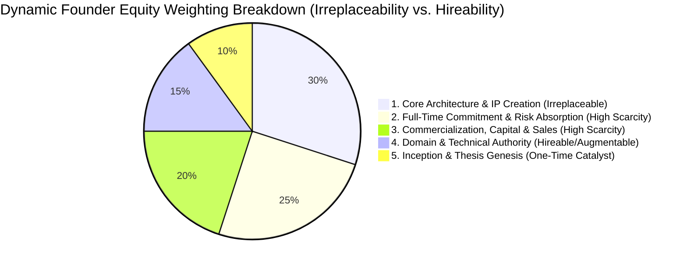
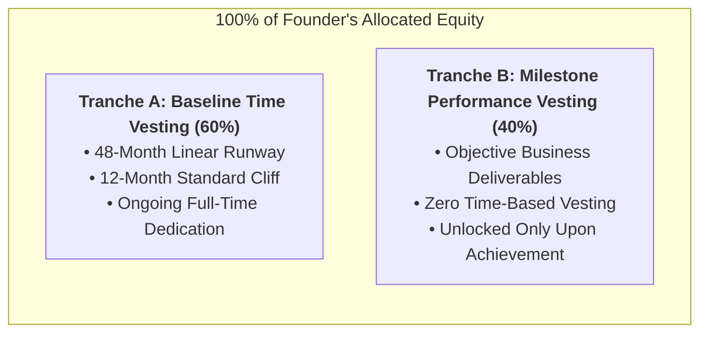

# Universal Founder Equity & Operating Framework (UEOF)
### A Venture-Grade Operating Agreement, Equity Allocation & Governance Blueprint

> **License:** Creative Commons Attribution 4.0 International (CC BY 4.0)  
> **Target Audience:** Startup Founders, Co-Founders, Technical Architects, Startup Counsel, and Early-Stage Investors  
> **Companion Blueprint:** [Universal Founder Contribution & Leadership Framework (UFCF)](./universal-founder-contribution-framework.md)  
> **Status:** Open Community Framework & Executable Template  
> **Purpose:** Eliminate co-founder equity disputes, establish objective equity allocation formulas, enforce Single-Threaded Ownership (STO), structure milestone-driven hybrid vesting, and institute Day-1 corporate governance.

---

## 1. Executive Summary & Philosophy

### 1.1 The Equal Split Fallacy
The most dangerous mistake early-stage startup teams make is the **"Gentlemen's 50/50 (or 33/33/33) Split"** agreed to over coffee on Day 1.

While equal splits feel polite and conflict-free in the first week, they almost always sow resentment by month six because:
1. **Unequal Risk Profiles:** One founder quits their high-paying job, takes zero salary, and funds legal incorporation out-of-pocket; another remains employed, works part-time on weekends, and takes zero personal financial risk.
2. **Unequal Value Delivery:** One founder designs and builds the core living production architecture that customers pay for; another acts as an ideator or project manager whose deliverables stop at slide decks.
3. **The "Vesting in Sleep" Trap:** Under traditional time-only vesting, an underperforming co-founder who leaves after 14 months retains 25% to 33% of the company's cap table forever, creating an un-investable "dead equity" roadblock for venture capitalists.

```
┌────────────────────────────────────────────────────────────────────────┐
│                   THE CARDINAL LAW OF FOUNDER EQUITY                   │
│                                                                        │
│  Equity is not a reward for past conversations. It is a capitalization │
│  tool designed to incentivize massive, sustained, and disproportionate │
│  value creation over the next 5 to 10 years.                           │
└────────────────────────────────────────────────────────────────────────┘
```

### 1.2 Core Pillars of the Universal Framework
This framework synthesizes best practices from top venture accelerators (Y Combinator, Techstars) and empirical allocation methodologies (Frank Demmler's Founder's Pie Model, Slicing Pie dynamic equity) into a unified, venture-ready standard:
* **The 5-Factor Weighted Value Matrix:** Replaces emotional bargaining with an objective mathematical allocation model.
* **Hybrid Two-Tranche Vesting:** Combines time-based runway (Tranche A) with objective milestone-gated deliverables (Tranche B).
* **Single-Threaded Ownership (STO):** Eliminates consensus paralysis by assigning exactly one accountable founder per business subsystem.
* **Day-1 IP & Legal Fortress:** Mandates immediate Invention Assignment (PIIA) and Section 83(b) tax elections before any code is written.

---

## 2. The 5-Factor Dynamic Equity Allocation Model

Instead of guessing equity percentages based on casual negotiations, founding teams evaluate each member across **five weighted value drivers**. 

> **The Weighting Rationale (Irreplaceability vs. Hireability):**  
> As established in the **[Universal Founder Contribution Framework (UFCF §2)](./universal-founder-contribution-framework.md#2-the-weighting-rationale-irreplaceability-vs-hireability)**, weights are governed by the **Economic Scarcity Principle**. Architecture, first-principles technical IP, and full-time risk absorption cannot be outsourced to agencies; domain knowledge and niche workflows—while vital for early customer grounding—can be augmented via specialist consultants and advisory councils.



---

### Factor 1: Venture Inception & Thesis Genesis (Weight: 10%)
*Who identified the systemic market problem, formulated the company thesis, funded the initial incorporation, and took the initial zero-to-one leap?*

* **10/10 Score:** Conceived the foundational insight, registered corporate entities, acquired digital/domain assets, funded early out-of-pocket legal/SaaS expenses, and recruited the co-founding team solo.
* **5/10 Score:** Joined within the first 30–60 days, helped refine the business thesis, and participated in early whiteboarding sessions.
* **1/10 Score:** Joined after the initial product prototype and legal entity were already established.

---

### Factor 2: Core Architecture & IP Creation (Weight: 30%)
*Who is authoring the living, surviving production code, designing the database schemas, implementing the security boundaries, and building the core product engine?*

* **10/10 Score:** Principal architect and primary code author. Produces >50% of the living production codebase; designs multi-tenant boundaries, security rules, APIs, and data models. Solves hard technical problems solo.
* **5/10 Score:** Contributes functional modules and features, but works within an architectural harness designed by others; relies on senior oversight for production deployment and security hardening.
* **1/10 Score:** Non-technical or non-producing founder who produces slide decks, wireframe mockups, or notes without building shipping artifacts.

---

### Factor 3: Full-Time Commitment & Personal Risk Absorption (Weight: 25%)
*Who has skin in the game? Who has resigned from full-time employment, absorbs zero salary, and carries personal financial risk?*

* **10/10 Score:** 100% full-time commitment from Day 1. Has resigned from all competing employment, receives $0 salary, and bears personal financial and career opportunity cost.
* **5/10 Score:** Working 15–25 hours per week on evenings/weekends while maintaining full-time external employment; committed to quitting upon seed funding.
* **1/10 Score:** Advisory capacity; invests <10 hours per week and assumes zero personal financial or career risk.

---

### Factor 4: Domain & Specialized Technical Authority (Weight: 15%)
*Who brings unique, irreplaceable domain depth (clinical, regulatory, cryptographic, machine learning) that gives the startup an unfair competitive advantage?*

* **10/10 Score:** Recognized subject-matter authority or specialized deep-tech engineer. Holds regulatory certifications, deep relationships with prospective enterprise buyers, or proprietary algorithmic expertise.
* **5/10 Score:** Generalist engineer or operator with relevant industry familiarity but without specialized regulatory credentials or proprietary expertise.
* **1/10 Score:** Novice to the problem domain with no prior industry network or specialized technical background.

---

### Factor 5: Commercialization, Capital & Enterprise Sales (Weight: 20%)
*Who connects technical output to revenue, leads enterprise pilot conversions, drives fundraising strategy, and closes paid customer contracts?*

* **10/10 Score:** Proven commercial leader. Leads institutional fundraising ($500k–$2M+), closes multi-year enterprise contracts, defines pricing tiers, and drives pilot-to-paid retention.
* **5/10 Score:** Capable of conducting customer interviews, managing user feedback loops, and assisting in sales collateral.
* **1/10 Score:** Reluctant or incapable of speaking to investors or closing customers.

---

## 3. Equity Allocation Calculator (Mathematical Example)

To illustrate how this model functions in practice, consider a 3-person founding team:
* **Founder A (Technical Architect & Inception Lead):** Full-time, conceived the company, wrote the production backend & frontend architecture solo, leads fundraising.
* **Founder B (Domain & Product Lead):** Full-time, brings 10 years of frontline industry experience, drives clinical/domain workflows and customer pilots.
* **Founder C (Infrastructure & Security Engineer):** Part-time (transitioning to full-time at seed round), sets up CI/CD, Terraform, and dynamic rendering engine.

### The Scoring Matrix

| Evaluation Factor | Weight | Founder A | Founder B | Founder C |
| :--- | :---: | :---: | :---: | :---: |
| **1. Venture Inception & Thesis** | 10% | 10 / 10 | 5 / 10 | 3 / 10 |
| **2. Core Architecture & IP** | 30% | 9.5 / 10 | 6.0 / 10 | 6.5 / 10 |
| **3. Full-Time Commitment & Risk** | 25% | 10 / 10 | 10 / 10 | 4.0 / 10 |
| **4. Domain & Technical Authority**| 15% | 8.5 / 10 | 10 / 10 | 7.0 / 10 |
| **5. Commercialization & Capital** | 20% | 9.0 / 10 | 6.5 / 10 | 3.0 / 10 |
| **Weighted Score (Sum)** | **100%** | **9.425** | **7.400** | **4.775** |
| **Normalized Equity Allocation** | **100%** | **43.6%** | **34.3%** | **22.1%** |

*Result:* Instead of an arbitrary 33/33/33 split that breeds resentment, the team arrives at an objective, transparent, and mathematically justified **44% / 34% / 22%** allocation grounded in verified risk, IP authorship, and commercial ownership.

---

## 4. Modern Hybrid Vesting Architecture: Tranche A & Tranche B

Traditional 4-year vesting with a 1-year cliff protects against Day-1 ghosting, but fails to incentivize specific milestones. The Universal Framework implements a **Two-Tranche Hybrid Vesting Schedule**:



---

### 4.1 Tranche A: Baseline Time Vesting (60% of Allocation)
* **Runway Duration:** 48 months from official incorporation / start date.
* **Cliff Period:** 12 months (standard venture cliff). If a founder leaves or is terminated before 12 months, **0% of Tranche A vests**.
* **Monthly Vesting:** After month 12, 25% of Tranche A vests immediately, and the remaining 75% vests in equal monthly increments over the remaining 36 months ($1/48\text{th}$ per month).

---

### 4.2 Tranche B: Milestone-Gated Performance Vesting (40% of Allocation)
Tranche B is completely immune to the passage of time. It vests **strictly upon the verifiable completion of high-impact corporate milestones**:

| Milestone | Tranche B Weight | Typical Delivery Window | Verification Standard |
| :--- | :---: | :---: | :--- |
| **Milestone 1: Production Baseline & Security Hardening** | **10%** | Months 1–4 | Production launch of v1.0 core architecture; automated security scanners passing with 0 critical/high vulnerabilities; multi-tenant RBAC enforced. |
| **Milestone 2: Commercial Traction & First Paid Pilots** | **10%** | Months 4–8 | Execution of first 3 to 5 signed, paid customer pilot contracts with verified recurring subscription revenue. |
| **Milestone 3: Platform Expansion & Ecosystem Release** | **10%** | Months 8–14 | Deployment of secondary product lines (e.g. billing engine, mobile app, training platform) with active daily usage. |
| **Milestone 4: Institutional Seed Round / Regional Scale** | **10%** | Months 12–18 | Successful closing of $\ge\$500,000$ institutional equity round OR reaching $\$250,000$ ARR run-rate across multi-state/multi-region operations. |

---

## 5. Single-Threaded Ownership (STO) & Decision Architecture

A startup cannot survive committee paralysis. When three people share ownership of a subsystem, **nobody owns it**. 

### 5.1 The RACI Matrix for High-Velocity Startups
Every functional vertical must have **exactly one Single-Threaded Owner (STO)** designated as **Accountable ($A$)**:

```
┌────────────────────────────────────────────────────────────────────────┐
│                        STO OPERATING BLUEPRINT                         │
│                                                                        │
│  • Accountable (A): ONE founder. Has unilateral decision rights.       │
│  • Responsible (R): Founders/engineers executing the work.             │
│  • Consulted (C): Co-founders whose expertise must be sought.          │
│  • Informed (I): Team kept abreast of decisions and outcomes.          │
└────────────────────────────────────────────────────────────────────────┘
```

### 5.2 Type 1 vs. Type 2 Decisions
Founders must distinguish between reversible and irreversible decisions (*Jeff Bezos Framework*):
* **Type 1 Decisions (One-Way Doors):** Irreversible or catastrophic if wrong (e.g., selling the company, taking venture debt, changing corporate jurisdiction, issuing dilutive equity).  
  $\rightarrow$ **Requires Majority or Supermajority Board Approval.**
* **Type 2 Decisions (Two-Way Doors):** Reversible with low switching costs (e.g., UI component styling, choosing an Express vs. Fastify router, running a marketing experiment, pricing tier adjustments).  
  $\rightarrow$ **The designated STO decides unilaterally within hours without a consensus meeting.**

### 5.3 The Disagree-and-Commit Covenant
1. Co-founders are expected to debate vigorously during design reviews and strategic sessions (*Radical Candor*).
2. Once the designated STO makes the final call on a Type 2 decision, all co-founders **commit 100% of their energy to making that decision succeed**.
3. Passive-aggressive resistance, foot-dragging, or *"I told you so"* culture is grounds for immediate founder reprimand.

---

## 6. Day-1 Legal Hygiene & Risk Protection

Founding teams must execute the following corporate documents on **Day 1**, before writing a single line of production code:

### 6.1 Proprietary Information and Inventions Agreement (PIIA)
* Every founder, contractor, and advisor must sign an **Invention Assignment Agreement**.
* All intellectual property, code repositories, domain names, patents, trademarks, design files, and business plans must be irrevocably assigned to the corporate entity.
* **Zero Hostage Code:** A departing founder cannot claim personal ownership of GitHub repositories, AWS/GCP accounts, or domain registrations.

### 6.2 The Mandatory Section 83(b) Tax Election
* **The 30-Day Hard Deadline:** Within **30 calendar days** of receiving unvested restricted stock, every US-taxpayer founder must file an IRS Section 83(b) election.
* **Why This is Load-Bearing:** Filing an 83(b) election locks in taxable value at the nominal incorporation price (e.g., $\$0.0001$ per share). Missing this 30-day deadline can trigger catastrophic tax liabilities as the startup raises capital and stock value rises.
* *Rule:* Proof of IRS certified-mail receipt must be uploaded to the company legal repository.

### 6.3 Good Leaver vs. Bad Leaver Protections
To protect the company against abandonment or bad faith, the Operating Agreement must define leaver categories:

* **Bad Leaver:**
  * Definition: Voluntary resignation within the first 12 months; termination for cause (fraud, embezzlement, felony, breach of fiduciary duty, gross negligence); willful abandonment of duties.
  * Consequence: All unvested shares (Tranche A and Tranche B) are forfeited immediately. The company retains an irrevocable option to repurchase all vested shares at the **lower of original purchase price or fair market value**.
* **Good Leaver:**
  * Definition: Termination without cause; death or permanent medical disability; mutual separation approved by the Board of Directors.
  * Consequence: Retains all vested Tranche A shares. Unvested Tranche A and unearned Tranche B shares return to the corporate treasury. The company holds Right of First Refusal (ROFR) on any proposed sale of vested shares.

---

## 7. Operational Cadence & Review SLAs

### 7.1 The 24-Hour Review SLA
To maintain extreme engineering and commercial velocity:
* **Pull Requests (PRs):** Must receive review, inline comments, or merge approval within **24 business hours**.
* **Design RFCs & Customer Proposals:** Must be reviewed within **24 business hours**.
* If a reviewer fails to respond within 24 hours without prior notice, the STO is empowered to merge or proceed autonomously.

### 7.2 The Quarterly Founder Calibration Review (FCR)
Every 90 days, co-founders conduct a structured, two-hour calibration session:
1. **Milestone Review:** Verify objective deliverables completed against Tranche B targets.
2. **Surviving Contribution Telemetry:** Review code footprint, customer contracts closed, and operational milestones achieved.
3. **Pillar Assessment:** Complete the 6-Pillar evaluation worksheet to surface latent friction or burnout.
4. **Scope Realignment:** Adjust STO vertical assignments as the company scales from prototype to commercialization.

---

## 8. Pluggable Co-Founder Operating Agreement Template (Copy & Execute)

Below is the standard, venture-aligned operating contract that any startup founding team can copy, complete, and sign:

```markdown
# CO-FOUNDER OPERATING & EQUITY ALLOCATION AGREEMENT

This Co-Founder Operating Agreement (the "Agreement") is entered into as of [Date], by and between:
* **Founder 1:** [Full Legal Name], residing at [Address]
* **Founder 2:** [Full Legal Name], residing at [Address]
* **Founder 3:** [Full Legal Name], residing at [Address]

WHEREAS, the Founders are collaborating to develop and commercialize [Company Name, LLC / Inc.] (the "Company"); and
WHEREAS, the Founders desire to establish their respective equity ownership, vesting schedules, decision-making rights, and operating principles.

NOW, THEREFORE, the Founders agree as follows:

### 1. Equity Allocation & Initial Shares
The initial equity ownership of the Company shall be allocated as follows:
* **Founder 1:** [Percentage]% ([Number] Shares)
* **Founder 2:** [Percentage]% ([Number] Shares)
* **Founder 3:** [Percentage]% ([Number] Shares)

### 2. Two-Tranche Vesting Schedule
All Founder shares shall be subject to the following hybrid vesting schedule:
* **Tranche A (60% of Total Allocation):** Vests over 48 months with a 12-month cliff. 25% vests on the first anniversary of [Start Date]; remaining vests in 36 equal monthly installments thereafter.
* **Tranche B (40% of Total Allocation):** Vests strictly upon achievement of the following objective milestones:
  - Milestone 1 (10%): [e.g. Production launch of v1.0 architecture with 0 critical security flaws]
  - Milestone 2 (10%): [e.g. Closing of 3 paid enterprise customer pilot contracts]
  - Milestone 3 (10%): [e.g. Launch of secondary product platform]
  - Milestone 4 (10%): [e.g. Closing of $500k+ institutional financing or $250k ARR]

### 3. Single-Threaded Ownership (STO)
The Founders establish the following STO decision rights:
* **Founder 1:** Accountable ($A$) for [Core Architecture, Infrastructure, Strategic Finance].
* **Founder 2:** Accountable ($A$) for [Clinical / Domain Product Engine, Customer Pilots].
* **Founder 3:** Accountable ($A$) for [DevOps, Security Automation, Dynamic Rendering].

All Type 2 (reversible) decisions within an assigned vertical are made autonomously by the designated STO without requiring consensus.

### 4. Intellectual Property Assignment
Each Founder hereby irrevocably assigns to the Company all right, title, and interest in and to all ideas, inventions, source code, data architectures, trademarks, and documentation developed in connection with the Company, whether created prior to or following the execution of this Agreement.

### 5. Tax Covenants
Each Founder agrees to timely file an election under Section 83(b) of the Internal Revenue Code within thirty (30) days of share issuance and provide certified proof of filing to the Company.

IN WITNESS WHEREOF, the Founders have executed this Agreement as of the date first written above.

_________________________________________      Date: __________________
[Founder 1 Signature]

_________________________________________      Date: __________________
[Founder 2 Signature]

_________________________________________      Date: __________________
[Founder 3 Signature]
```

---

## 9. Conclusion: Foundations That Scale

Great companies are built on transparent, unemotional agreements executed when relationships are harmonious. Waiting for a dispute to arise before establishing equity formulas, vesting cliffs, and decision rights is an existential gamble.

By executing the **Universal Founder Equity & Operating Framework**, your startup secures the legal, operational, and emotional clarity necessary to survive the early wilderness and build enduring enterprise value.

*Align early. Execute relentlessly. Win together.*
