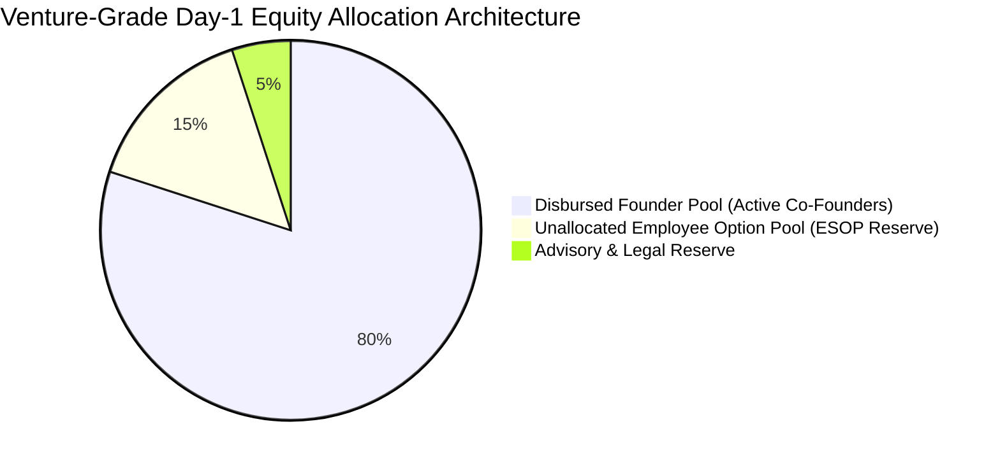
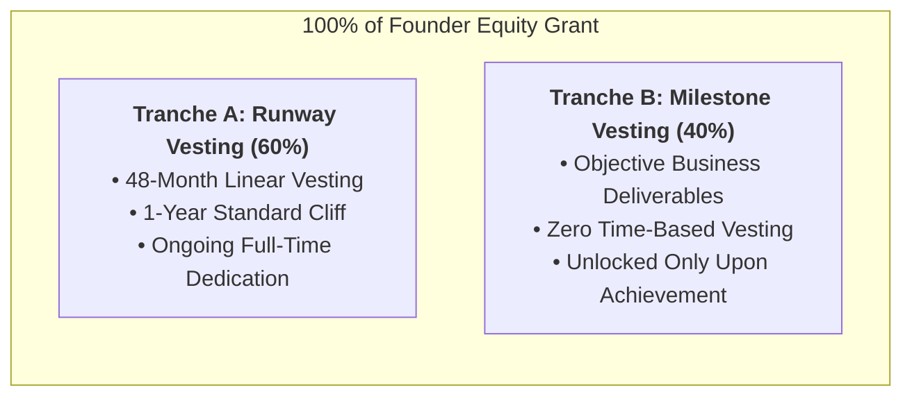
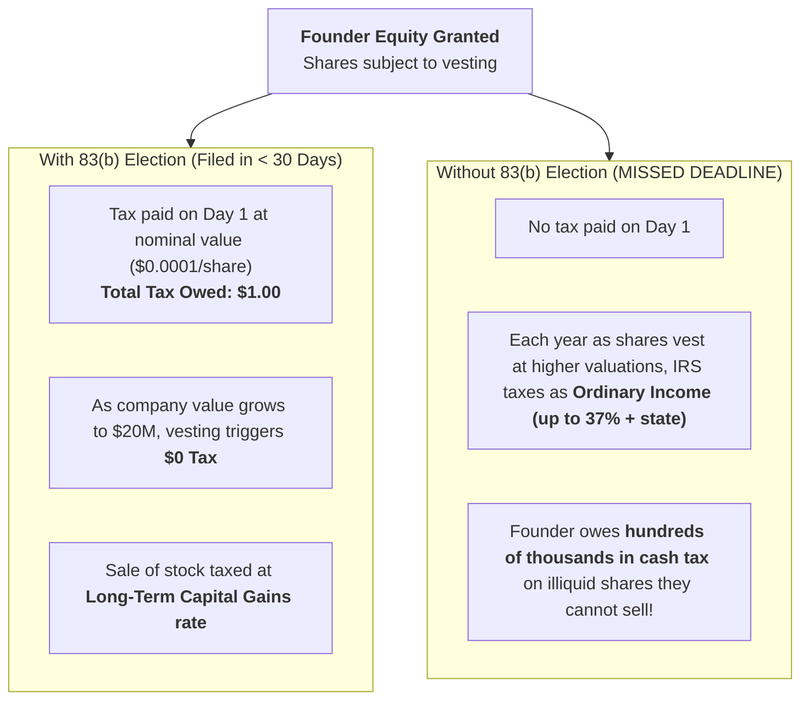

# Cap Table & Hybrid Vesting Playbook
### How to Structure Venture-Ready Startup Equity, Option Pools, Milestone Tranches, and Avoid Catastrophic Dilution

> **"A poorly structured cap table on Day 1 is an unforced error that will kill your company at Series A."**  
> — Silicon Valley Seed Investor Axiom

---

## 1. The Anatomy of an Early-Stage Cap Table

Before writing code or granting shares, founders must structure the company's authorized and issued equity pool.



### Why the Unallocated Option Pool (15% – 20%) is Mandatory on Day 1:
Many first-time founders allocate 100% of issued shares amongst themselves on Day 1. When they hire their first senior engineer, head of sales, or bring on independent board members, they are forced to amend the corporate charter and suffer direct dilution.
* **The 80/20 Rule:** Disburse **80% to 85%** to the active founding team; reserve **15% to 20%** in the corporate treasury as unallocated equity for future key hires and option grants.

---

## 2. The Hybrid Two-Tranche Vesting Architecture

Traditional venture vesting assigns 100% of founder equity to a 4-year linear time schedule with a 1-year cliff. While effective at stopping immediate flight, it completely fails to protect against **"vesting in sleep"** (a co-founder who does the bare minimum while letting peer founders pull the actual weight).

The modern solution is **Two-Tranche Hybrid Vesting**:



### 2.1 Tranche A: Time-Based Runway (50% – 60% of Grant)
* **Purpose:** Compensates long-term commitment, daily operational presence, and opportunity cost.
* **Schedule:** Vests monthly over 48 months (4 years).
* **The 1-Year Cliff:** If a founder leaves or is terminated within the first 12 months, **0% of Tranche A vests**. At month 12, 25% vests in a lump sum; thereafter, $1/48\text{th}$ vests each month.

### 2.2 Tranche B: Milestone-Gated Deliverables (40% – 50% of Grant)
* **Purpose:** Ties substantial equity directly to objective, verifiable achievements that de-risk the company.
* **Structure:** Divided into 3 to 4 distinct, un-gameable company milestones:

| Milestone | Typical Tranche % | Target Window | Verifiable Deliverable & Proof Criteria |
| :--- | :---: | :---: | :--- |
| **M1: Production Architecture & Security** | 10% | Months 1–4 | Production launch of v1.0 core engine; CI/CD active; automated security scanners passing with 0 critical/high findings. |
| **M2: Commercial Traction & Paid Pilots** | 10% | Months 4–8 | Execution of 3 to 5 signed, paying pilot customer contracts with verified recurring revenue. |
| **M3: Platform Expansion & Ecosystem** | 10% | Months 8–14 | Rollout of secondary product suites (e.g. mobile apps, billing pipelines, LMS) with verified active daily users. |
| **M4: Institutional Seed Round / Scale** | 10% | Months 12–18 | Closing of $\ge\$500,000$ institutional priced/SAFE round OR reaching $\$250,000$ annual recurring revenue run-rate. |

---

## 3. Acceleration Mechanics: Single vs. Double Trigger

What happens to unvested shares if the startup is acquired?

```
┌────────────────────────────────────────────────────────────────────────┐
│                   EQUITY ACCELERATION COMPARISON                       │
├──────────────────────────────────┬─────────────────────────────────────┤
│  SINGLE-TRIGGER ACCELERATION     │  DOUBLE-TRIGGER ACCELERATION        │
│  (Acquisition Only)              │  (Acquisition + Involuntary Term)   │
├──────────────────────────────────┼─────────────────────────────────────┤
│ • 100% of unvested shares vest   │ • Unvested shares accelerate ONLY   │
│   immediately upon Change of     │   if company is acquired AND the    │
│   Control (merger or buyout).    │   founder is fired without cause    │
│                                  │   or constructively dismissed.      │
├──────────────────────────────────┼─────────────────────────────────────┤
│ ❌ RED FLAG TO INVESTORS:        │ ✅ VENTURE CAPITAL GOLD STANDARD:   │
│ Acquirers refuse to buy because  │ Acquirers are protected; founders   │
│ key founders can walk away on    │ are protected against hostile post- │
│ closing day with full payout.    │ acquisition terminations.           │
└──────────────────────────────────┴─────────────────────────────────────┘
```

> **The Founder Rule:** Always insist on **Double-Trigger Acceleration** for all founder grants. Investors require it, and it protects you from being ousted post-acquisition without your unvested equity.

---

## 4. The Statutory 30-Day IRS Section 83(b) Tax Trap

If your company is structured as a US entity (Delaware C-Corp or LLC taxed as corporation/partnership), **failing to file an 83(b) election within 30 days is an irreversible financial disaster**.



### The 83(b) Execution Checklist:
1. Complete the Section 83(b) form on the day stock is granted.
2. Send via **USPS Certified Mail with Return Receipt Requested** to the IRS within 30 calendar days.
3. Save the postal stamped receipt and copy of the form permanently in your company legal vault.

---

## 5. SAFEs vs. Convertible Notes vs. Priced Equity Rounds

When raising initial capital:
* **Y Combinator Post-Money SAFE:** The modern standard. Simple, no interest rate, no maturity date, and calculates dilution transparently on the post-money valuation cap.
* **Dilution Reality Check:** If you raise \$1,000,000 on a \$5,000,000 post-money valuation cap, you have sold exactly 20% of your company.

---

## 6. Checklist: Before Finalizing Your Cap Table
- [ ] Incorporate entity (Delaware C-Corp or State LLC with clear operating agreement).
- [ ] Create authorized share pool (e.g. 10,000,000 common shares).
- [ ] Disburse 80% to 85% to founding team with Two-Tranche Vesting.
- [ ] Reserve 15% to 20% in unallocated ESOP option pool.
- [ ] Require every founder to sign Proprietary Information & Inventions Assignment (PIIA).
- [ ] Enforce certified-mail filing of Section 83(b) elections within 30 days.
