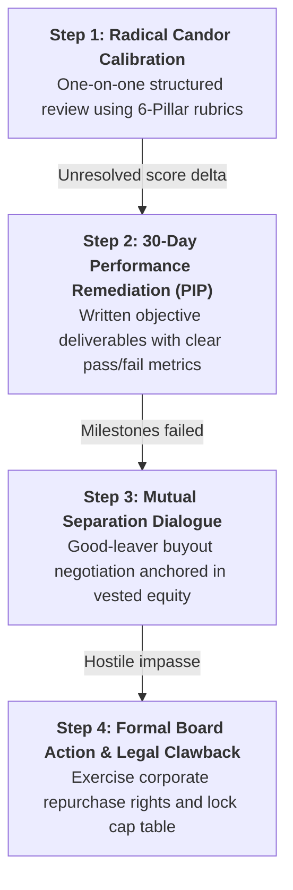

# Co-Founder Conflict & Separation Playbook
### How to Detect Founder Misalignment Early, Execute Good/Bad Leaver Provisions, and Cure "Dead Equity" Before It Kills Your Startup

> **"Co-founder conflict is the number one cause of early startup death. It is not lack of market demand; it is two or three people who cannot work together anymore."**  
> — Paul Graham, Y Combinator

---

## 1. The Early Warning Signals of Founder Misalignment

Co-founder splits rarely happen overnight. They fester over months through observable behavioral shifts:

```
┌────────────────────────────────────────────────────────────────────────┐
│                      FOUNDER DYSFUNCTION SPECTRUM                      │
├──────────────────────┬────────────────────────┬────────────────────────┤
│ 1. THE 90% FINISHER  │ 2. THE EMPLOYEE MINDSET│ 3. THE MISSING AGENCY  │
│    STALL             │                        │                        │
├──────────────────────┼────────────────────────┼────────────────────────┤
│ • Enthusiastic during│ • Waits for tasks to   │ • Distracted by side   │
│   initial whiteboard/│   be assigned in Jira. │   gigs, consulting, or │
│   prototype phase.   │ • Expects 40-hour work │   personal projects.   │
│ • Completely stalls  │   weeks and guaranteed │ • Unwilling to make    │
│   on the grueling    │   pay while holding    │   personal sacrifices  │
│   last 10% (tests,   │   30%+ founder equity. │   or absorb early risk │
│   security, bugs).   │ • Defers all hard calls│ • Blames external      │
│ • "Hatti chiryo,     │   back to peer         │   factors for missed   │
│   pucchar adkiyo."   │   founders.            │   deliverables.        │
└──────────────────────┴────────────────────────┴────────────────────────┘
```

---

## 2. The 4-Step Escalation & Mediation Protocol

Before consulting corporate counsel or initiating separation, the founding team must follow a structured, documented protocol:



### Step 1: Radical Candor Calibration (Day 1)
* Schedule a dedicated, 2-hour offline session outside the office.
* Walk through the **Quarterly Founder Calibration Worksheet** line-by-line.
* Separate *personal affection* from *fiduciary company performance*. State observable facts: *"PRs are unreviewed for 5 days," "The billing integration is 6 weeks behind," "Zero enterprise customer demos led this month."*

### Step 2: The 30-Day Milestone Sprint (Days 2–30)
* If the co-founder commits to realigning, write down **3 non-negotiable deliverables** with binary pass/fail criteria.
* If all 3 deliverables are completed with high quality, the founder remains in good standing.
* If any deliverable is abandoned, both parties agree in writing that the co-founder relationship must terminate.

---

## 3. Good Leaver vs. Bad Leaver: Contractual Definitions

Every venture-grade Operating Agreement must draw an unambiguous line between departing in good faith versus breaching founder duties:

```
┌────────────────────────────────────────────────────────────────────────┐
│                        LEAVER PROVISION MATRIX                         │
├──────────────────────────────────┬─────────────────────────────────────┤
│  GOOD LEAVER                     │  BAD LEAVER                         │
├──────────────────────────────────┼─────────────────────────────────────┤
│ • Catastrophic health emergency  │ • Termination for cause: fraud,     │
│ • Mutual, amicable agreement     │   theft, embezzlement, or felony.   │
│   approved by Board of Directors │ • Willful abandonment of duties /   │
│ • Termination without cause      │   refusal to perform assigned STO.  │
│ • Family crisis or bereavement   │ • Breach of IP Invention Assignment │
│                                  │   or trade secret theft.            │
├──────────────────────────────────┼─────────────────────────────────────┤
│ EQUITY CONSEQUENCE:              │ EQUITY CONSEQUENCE:                 │
│ • Retains all vested Tranche A.  │ • 100% of unvested shares forfeit.  │
│ • Unvested Tranche A & B return  │ • Company holds irrevocable option  │
│   to corporate option pool.      │   to repurchase ALL vested shares   │
│ • Company retains ROFR on sale.  │   at par value ($0.0001/share).     │
└──────────────────────────────────┴─────────────────────────────────────┘
```

---

## 4. How to Cure "Dead Equity" Before Institutional Rounds

**Dead Equity** occurs when an ex-founder who left 6 months into the company owns 20% to 30% of the cap table. 

**No top-tier venture fund will invest in a company where a non-working ex-founder owns more equity than the active CEO or CTO.**

### Remediation Strategies:
1. **The Day-1 Pre-Emptive Fix (Two-Tranche Vesting):** Under our framework, an ex-founder who quits in month 6 leaves with **0% of Tranche A** (due to the 1-year cliff) and **0% of unearned Tranche B**. Dead equity is mathematically prevented.
2. **The Equity Recapitalization (The Reset):** If a departing founder refuses to surrender unearned shares, the active founders, board, and investors can:
   * Dissolve the original entity and re-incorporate a new corporate entity, re-assigning IP under legitimate business distress (*the nuclear option*).
   * Authorize a heavy dilutive recapitalization round or stock split approved by the majority voting shareholders.
3. **The Amicable Cap Table Buyout:** Offer the departing founder a fair, clean settlement:
   * Retain 1% – 3% as non-voting common stock or advisory shares in recognition of early zero-to-one contributions.
   * Promissory note for out-of-pocket expenses contributed on Day 1.
   * Immediate full mutual release of all claims and non-disparagement covenants.

---

## 5. Separation Checklist for Startup Founders
- [ ] Document all performance issues and written communications.
- [ ] Determine Good Leaver vs. Bad Leaver classification under the Operating Agreement.
- [ ] Calculate vested Tranche A shares through the effective separation date.
- [ ] Confirm 0% vesting for incomplete Tranche B milestones.
- [ ] Immediately revoke administrative access to: GitHub organizations, AWS/GCP cloud roots, domain registrars, corporate bank accounts, and Google Workspace.
- [ ] Execute formal **Founder Separation and Release Agreement**.
- [ ] File stock repurchase documentation with corporate secretary.
- [ ] Return unvested shares to the unallocated employee option pool.
- [ ] Communicate calmly and transparently to team and investors.
