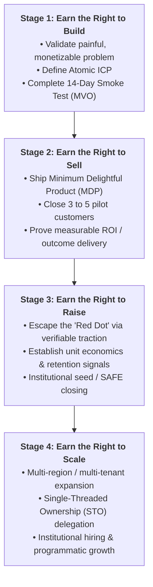
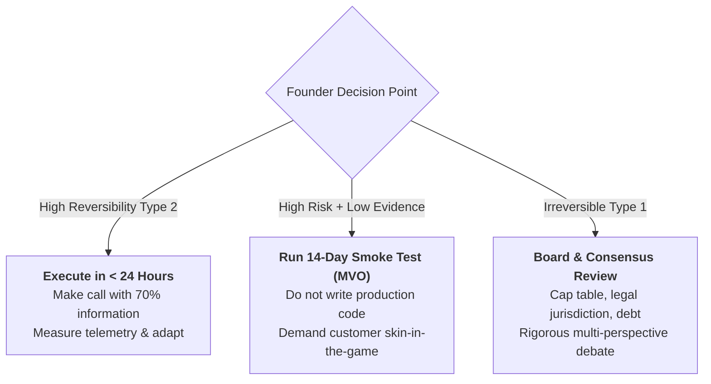
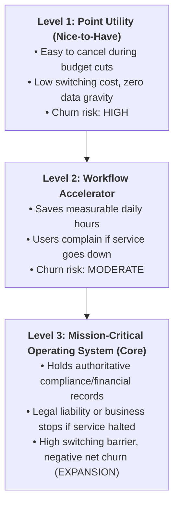

# Earned Rights & Venture Validation Playbook
### How Early-Stage Founders Escape the "Red Dot", De-Risk Extreme Uncertainty, and Build Mission-Critical Products

> **"You do not have the right to scale before you have the right to sell. You do not have the right to sell before you have the right to build. And you do not have the right to build before you have proved that someone is bleeding."**  
> — The Earned Rights Principle

---

## 1. The "Earn The Right" (ETR) Framework

The fatal flaw of most first-time startup founders is **premature execution**:
* Raising venture capital before validating customer pain.
* Hiring junior engineers before designing the core architecture.
* Launching paid Google/LinkedIn ads before establishing product-market fit.
* Building multi-tenant microservices before a single customer has completed a workflow.

The **Earn The Right (ETR)** framework re-conceptualizes startup progression as a strict sequence of earned milestones:



---

## 2. Escaping the "Red Dot" (There Is No Money)

Every founder begins at the **Red Dot**: zero revenue, zero brand credibility, zero code, and zero institutional capital.

```
┌────────────────────────────────────────────────────────────────────────┐
│                     THE CAPITAL-TRACTION PARADOX                       │
├──────────────────────────────────┬─────────────────────────────────────┤
│  THE NAIVE FOUNDER APPROACH      │  THE EARNED RIGHT APPROACH          │
├──────────────────────────────────┼─────────────────────────────────────┤
│ "We need $1,000,000 in pre-seed  │ "We assume zero external capital    │
│  funding to build the product    │  is coming. We build a functional   │
│  and find our first customer."   │  prototype solo, secure 3 letters   │
│                                  │  of intent, and create momentum."   │
├──────────────────────────────────┼─────────────────────────────────────┤
│ ❌ TRAPPED AT RED DOT            │ 🚀 ESCAPES THE RED DOT              │
│ Pitch decks without evidence     │ Evidence forces investor FOMO;      │
│ receive endless polite rejections│ capital chases verified momentum.   │
└──────────────────────────────────┴─────────────────────────────────────┘
```

### The Two Escape Vectors:
1. **The Credibility Vector:** When founders bring 10+ years of deep regulatory, clinical, or technical authority and proprietary distribution networks.
2. **The Traction Vector:** When founders break through inertia by shipping a working zero-to-one artifact and converting users into active advocates without spending marketing dollars.

---

## 3. The Extreme Uncertainty Decision Matrix

Founders operate in extreme chaos where 80% of variables are unknown. Waiting for certainty causes death by hesitation.

Use the **3-Factor Uncertainty Filter** to prioritize decisions:



### The Uncertainty Scoring Matrix:
$$\text{Priority Score} = \frac{\text{Customer Impact} \times \text{Strategic Urgency}}{\text{Capital Burn} \times \text{Reversibility Cost}}$$

---

## 4. The 14-Day Minimum Viable Offering (MVO) Smoke Test

Before spending three months writing backend code and frontend interfaces, run a **14-Day Smoke Test**:

1. **The Core Claim:** State the single quantifiable promise in one sentence:  
   * *"We eliminate 8 hours of weekly manual MAR charting for developmental disability agencies, reducing medication error risk by 90%."*
2. **The Demand Hurdle:** Do not accept verbal praise (*"That sounds like a great idea!"*). Demand skin-in-the-game:
   * A signed Letter of Intent (LOI) to pilot.
   * A refundable $500 pilot deposit.
   * Access to sample anonymized datasets or workflow shadow sessions.
3. **The 14-Day Kill Switch:** If after 14 days of outreach to 30 qualified targets zero prospects commit, **kill or pivot the thesis immediately**. Do not write code to rescue an unvalidated idea.

---

## 5. Defining Your "Atomic ICP"

Startups die by marketing to "all healthcare agencies" or "all small businesses." Define your **Atomic ICP (Ideal Customer Profile)** across six precise filters:

```
┌────────────────────────────────────────────────────────────────────────┐
│                        THE ATOMIC ICP FRAMEWORK                        │
├──────────────────────┬─────────────────────────────────────────────────┤
│ 1. Trigger Event     │ What just broke in their organization?          │
│                      │ (e.g. Failed a state compliance audit; lost 3   │
│                      │  caregivers to manual charting burnout)         │
├──────────────────────┼─────────────────────────────────────────────────┤
│ 2. Economic Buyer    │ Who owns the P&L and has credit card authority? │
│                      │ (e.g. Agency Executive Director, not staff)     │
├──────────────────────┼─────────────────────────────────────────────────┤
│ 3. Critical Pain     │ What happens if they do nothing for 6 months?   │
│                      │ (e.g. Revocation of state provider license)     │
├──────────────────────┼─────────────────────────────────────────────────┤
│ 4. Tech Maturity     │ Can they adopt modern SaaS without 6 months of  │
│                      │ enterprise IT professional services?            │
├──────────────────────┼─────────────────────────────────────────────────┤
│ 5. Buying Cycle      │ Can this deal close in < 30 days on a standard  │
│                      │ commercial contract without committee review?   │
├──────────────────────┼─────────────────────────────────────────────────┤
│ 6. Referenceability  │ Will this customer agree to be a public case    │
│                      │ study and take reference calls for future sales?│
└──────────────────────┴─────────────────────────────────────────────────┘
```

---

## 6. "Becoming Core": Shifting from Nice-to-Have to Mission-Critical

Venture-backed enterprises are built on **system-of-record software**, not superficial point utilities.



### The 4 Levers to Become Core:
1. **Data Gravity:** House the primary source of truth (e.g., electronic health records, EVV GPS logs, payroll calculations) that cannot easily be migrated.
2. **Regulatory & Compliance Shielding:** Automatically generate the official state audits, compliance reports, and statutory filings required by law.
3. **Deep Infrastructure Integrations:** Connect directly to identity providers (SSO), payroll clearinghouses, and state Medicaid APIs.
4. **Quantified ROI Proof:** Surface live dashboards showing executive buyers exactly how many dollars, hours, and error incidents your platform prevented this month.

---

## 7. The 5-Pillar User Journey Audit

To build product-led retention, evaluate your user lifecycle across **5 fundamental gates**:

| Pillar | Focus Area | What "World-Class" Looks Like | Common Failure Mode |
| :--- | :--- | :--- | :--- |
| **1. Onboarding** | First 10 minutes | Self-serve tenant creation; automated data import; < 5 min to first "Aha!" moment | 20-page PDF manual required; 3-week onboarding backlog |
| **2. Data Ingestion** | Frictionless input | Seamless mobile capture, voice notes, automated pre-fills, bulk CSV import | Exhaustive 40-field forms that caregivers abandon |
| **3. Core Value** | Instant gratification | Immediate task completion; zero lag; intuitive navigation; visual clarity | Cluttered dashboards with 50 options and zero guidance |
| **4. Outcome Delivery** | Customer mission | Automated generation of signed MAR PDFs, billing batches, or state filings | Data goes into a black hole; customer must manually re-export |
| **5. Measurement** | Executive visibility | Weekly digest to leadership quantifying compliance score and hours saved | Executive buyer has zero visibility into platform usage |

---

## 8. Founder Checklist: Are You Earning the Right?
- [ ] Have you defined your **Atomic ICP** with specific trigger events?
- [ ] Have at least 3 prospective customers passed the **14-Day Demand Hurdle** (LOI or deposit)?
- [ ] Are you building a **Level 3 Mission-Critical Core** platform or a dispensable Level 1 utility?
- [ ] Does your product pass the **5-Pillar User Journey Audit** with $< 5\text{ min}$ time to first value?
- [ ] Are you solving the problem with **minimalist architecture (KISS)** before attempting to scale?
