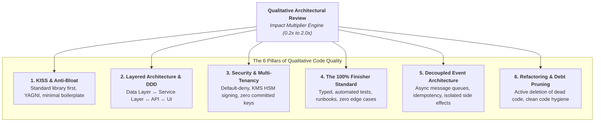

# Programming Best Practices & Qualitative Impact Evaluation Guide
### Moving Beyond Vanity Metrics: How to Quantify Architectural Rigor, Code Quality, and Engineering Force Multipliers

> **"Measuring programming progress by lines of code is like measuring aircraft building progress by weight."**  
> — Bill Gates

---

## 1. The Fallacy of Pure Quantitative Metrics

In early-stage startups and technical due diligence, evaluating an engineer or founder solely on **commits, PR count, or raw lines added** is fundamentally flawed:

```
┌────────────────────────────────────────────────────────────────────────┐
│                   THE ARCHITECTURAL VALUE DICHOTOMY                    │
├──────────────────────────────────┬─────────────────────────────────────┤
│  THE BRITTLE BUILDER             │  THE ARCHITECTURAL MULTIPLIER       │
│  (High Activity, Low Impact)     │  (High Leverage, Enduring Value)    │
├──────────────────────────────────┼─────────────────────────────────────┤
│ • Writes 10,000 lines of brittle │ • Writes 400 lines of clean, test-  │
│   copy-paste code without tests. │   backed, decoupled architecture.   │
│ • Directly queries database in   │ • Establishes strict data boundaries│
│   UI controllers; leaks tenants. │   preventing cross-tenant leaks.    │
│ • Produces 40 regressions that   │ • Deletes 3,000 lines of dead debt; │
│   require 3 weeks of team debug. │   unblocks 4 developers immediately.│
├──────────────────────────────────┼─────────────────────────────────────┤
│ ❌ RAW GIT METRIC: 10,000 lines   │ ❌ RAW GIT METRIC: -2,600 lines      │
│ 📉 ENTERPRISE IMPACT: Negative   │ 🚀 ENTERPRISE IMPACT: 100x Positive │
└──────────────────────────────────┴─────────────────────────────────────┘
```

To establish an objective, defensible standard, the **Universal Founder Framework** couples quantitative Git telemetry with a **Qualitative Architectural Quality Multiplier ($0.2\times \text{ to } 2.0\times$)**.

---

## 2. The 6 Qualitative Architectural Paradigms



---

### Paradigm 1: KISS (Keep It Simple, Stupid) & Anti-Bloat
*Great software is not defined by how much code was written, but by how little code was needed to solve the problem.*

* **Native Standard Library over Dependency Bloat:** Avoid pulling in massive third-party packages for trivial tasks (e.g. `left-pad`, `is-odd`, bloated date libraries when native `Intl` or stdlib suffices).
* **YAGNI (You Aren't Gonna Need It):** Reject speculative abstractions, configurable plugin engines, and multi-cloud adapters before achieving product-market fit. Solve today's concrete customer problem simply.
* **Minimalist Surface Area:** Keep APIs and UI components focused. Clean, concise, readable code beats clever, impenetrable one-liners.

---

### Paradigm 2: Separation of Concerns & Layered Architecture (DDD)
*Every software component must have exactly one reason to change.*

Any production application—whether in TypeScript, C#, Go, Python, Ruby, or Java—must enforce a **strict 4-tier layered architecture**:

```mermaid
graph TD
    db[(Database / Storage Engine)] <--> repo[Repository Layer (Data Access)]
    repo <--> svc[Service Layer (Business Logic & Compliance)]
    svc <--> api[API / Controller Layer (HTTP Boundary & Auth)]
    api <--> fe[Client Presentation Layer (UI / Views)]
```

#### A. Repository Layer (Data Access)
* **Rule:** Contains raw database queries (PostgreSQL, Firestore, MongoDB, EF Core, ActiveRecord).
* **Boundary:** Zero business logic or access control allowed here. Must return clean, typed domain entities.

#### B. Service Layer (Business Logic & Compliance)
* **Rule:** Orchestrates transactions, executes business validation, checks tenant permissions, and triggers audit logs.
* **Boundary:** Technology-agnostic. Does not know whether the caller is a REST endpoint, a CLI command, or a background worker.

#### C. API / Controller Layer (HTTP Boundary)
* **Rule:** Validates HTTP headers, verifies JWT/bearer tokens, parses params, and maps errors to standard HTTP status codes.
* **Boundary:** **NEVER directly instantiate database queries or query collections in controllers.** Always route through the Service layer.

#### D. Presentation / Client Layer
* **Rule:** Stateless rendering, component reusability, and user interaction handling.
* **Boundary:** **NEVER perform client-side security filtering.** Client code must treat all server responses as untrusted boundaries.

---

### Paradigm 3: Security, Privacy & Multi-Tenancy by Design
*In enterprise software, a single tenant data leak can destroy company value overnight.*

* **Default-Deny Multi-Tenancy:** Database security rules and backend queries must verify tenant ownership (`agencyId`, `organizationId`) at the data layer. Never rely on the client to supply their own tenant ID without server-side verification.
* **Zero Hardcoded Secrets:** Service-account keys, API credentials, and JWT signing secrets must live in Secret Manager (GCP Secret Manager, AWS Secrets Manager, Azure Key Vault). Committing `.env` secrets fails CI immediately.
* **Cryptographic Token Verification:** Use asymmetric cryptographic token signing (RS256 with KMS HSM) or verified OIDC/SAML claims. Never verify auth roles from self-writable user documents.
* **Zero PII/PHI in Log Sinks:** Never log plaintext passwords, credit card numbers, Social Security Numbers, or patient health records in console output or log analytics.

---

### Paradigm 4: The "100% Finisher" Standard (*Hatti Chiryo, Pucchar Adkiyo*)
*A feature is not done when the prototype works on localhost. A feature is done when it is running reliably in production for paying customers.*

The **6 Gates of Production Done**:
1. **Typed:** Strict type checking (`noImplicitAny: true` in TypeScript, strict typing in C#/Go/Rust).
2. **Tested:** Automated unit and integration tests covering positive flows, failure modes, and concurrency edge cases.
3. **Secured:** Passes automated static analysis, dependency vulnerability scans, and tenant boundary tests.
4. **Documented:** Clear API contracts, architectural RFCs, and operational runbooks for support teams.
5. **Monitored:** Structured error logging, performance metrics, and client error boundaries.
6. **Deployed:** Cleanly deployed through automated CI/CD pipelines without manual server SSH interventions.

---

### Paradigm 5: Decoupled Event Architecture
*Monoliths choke when secondary side effects are coupled directly to transactional requests.*

* **Decoupled Egress:** When an action occurs (e.g. `user.registered`, `medication.administered`), the primary transaction must not synchronously block on sending emails, generating PDFs, or pinging external webhooks.
* **Publisher / Subscriber Pattern:** Publish an event to an internal message queue or events collection (`PureDataEvent`). Dedicated worker consumers handle downstream side effects asynchronously.
* **Idempotent Handlers:** All event handlers and webhook consumers must be strictly idempotent to survive network retries and duplicate deliveries.

---

### Paradigm 6: Refactoring Discipline & Dead Code Pruning
*The most senior engineers are often those who delete the most code.*

* **Proactive Debt Remediation:** When touching existing modules, leave them cleaner than you found them (*The Boy Scout Rule*).
* **Aggressive Deletion:** Delete commented-out code blocks, deprecated API routes, and unused feature flags. Git history remembers; the production repo must stay lean.
* **High Test-to-Code Ratio:** An engineering team with 1 test file per 10 source files is building a house of cards. Maintain disciplined test suites for all critical paths.

---

## 3. The Qualitative Quality Multiplier Matrix

To bridge raw Git metrics into real business and enterprise value, use the **Architectural Quality Multiplier**:

| Multiplier Tier | Score Range | Observable Behavioral & Architectural Profile |
| :---: | :---: | :--- |
| **Toxic Drag** | **$0.2\times – 0.5\times$** | Writes brittle, untested code that breaks existing features. Bypasses security rules; hardcodes API keys in git; leaves features 80% finished (*90% finisher syndrome*); requires constant oversight and cleanup from peers. |
| **Parity Contributor** | **$0.8\times – 1.0\times$** | Reliable at implementing clearly defined tickets within existing architectures. Writes standard unit tests; follows established patterns; rarely introduces systemic refactorings or raises peer standards. |
| **Architectural Anchor** | **$1.2\times – 1.5\times$** | Autonomous and disciplined. Designs clean multi-tenant systems; adheres strictly to DDD layered boundaries; handles edge cases and automated tests; reviews PRs within 24 hours. |
| **Force Multiplier (Bar Raiser)** | **$1.8\times – 2.0\times$** | Redefines engineering excellence. Authors foundational abstractions that eliminate thousands of lines of debt; hardens security to institutional enterprise standards; mentors team members; ships from 0 to 1 with uncompromising velocity. |

---

## 4. The Calibrated Impact Formula

When evaluating founders during a **Quarterly Founder Calibration Review (FCR)** or technical due diligence:

$$\text{Calibrated Founder Impact} = \text{Surviving Production Lines} \times \text{Architectural Quality Multiplier}$$

### Example Case Study:
* **Founder A (The Churner):**  
  - Surviving Code: 12,000 lines  
  - Quality Profile: Leaky abstractions, zero automated tests, 2 production outages caused by missed edge cases, bypassed security checks.  
  - Quality Multiplier: **$0.4\times$**  
  - **Calibrated Impact:** $12,000 \times 0.4 = \mathbf{4,800\text{ Impact Units}}$

* **Founder B (The Clean Architect):**  
  - Surviving Code: 6,000 lines  
  - Quality Profile: Clean DDD layered architecture, 92% automated test coverage, KMS asymmetric token security, comprehensive docs, unblocked 3 junior developers.  
  - Quality Multiplier: **$1.8\times$**  
  - **Calibrated Impact:** $6,000 \times 1.8 = \mathbf{10,800\text{ Impact Units}}$

*Result:* Despite having half the raw line count, Founder B created **more than double the verifiable enterprise value** of Founder A.

---

## 5. Instructions for AI Coding Agents & Code Reviewers

When conducting an automated or assisted code audit using the `founder-audit` skill:
1. **Never stop at `git blame` line counts.** Line count is the starting baseline, not the conclusion.
2. **Inspect architectural boundaries:** Check whether controllers directly invoke database models, or if the 4-tier DDD boundary is maintained.
3. **Verify test coverage:** Compare lines of test code (`.test.`, `spec`, `__tests__`) against lines of business logic.
4. **Audit security posture:** Search for committed secrets, plaintext PHI/PII logging, or unauthenticated HTTP routes.
5. **Assign the Quality Multiplier:** Ground the multiplier in specific pull requests, commit hashes, and architectural artifacts.
