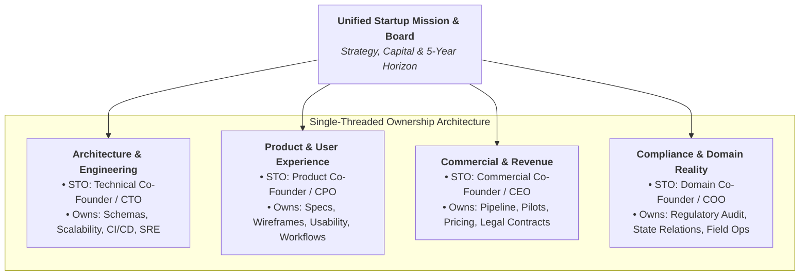
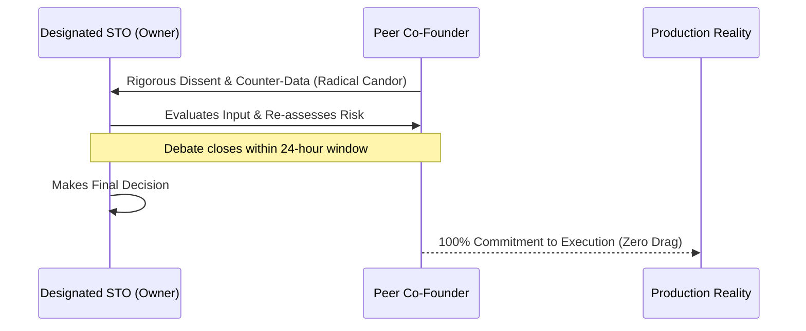

# Single-Threaded Ownership (STO) Playbook
### How High-Velocity Founding Teams Make Decisions, Eliminate Consensus Drag, and Execute with Extreme Accountability

> **"If more than one person owns a problem, nobody owns it."**  
> — First Principle of Startup Operating Velocity

---

## 1. The Death of Consensus: Why Startups Die by Committee

In early-stage startups, co-founders often mistake **alignment** for **consensus**.

Alignment means everyone is rowing in the exact same strategic direction with full context. Consensus means everyone must agree on every tactical decision before action is taken.

When early teams seek universal consensus:
1. **Decision Velocity Collapses:** Simple architectural choices, pricing tests, or UI flows sit in limbo waiting for the next "all-hands sync."
2. **Accountability Disappears:** When a committee decides, no single human is responsible when things fail. Finger-pointing replaces root-cause retrospectives.
3. **Lowest-Common-Denominator Outcomes:** Bold, opinionated product ideas get diluted into bland, compromised compromises that neither founders nor users love.
4. **Resentment Festers:** The founder with highest agency and domain expertise feels constantly tethered to founders who lack the context to make the decision.

---

## 2. The Single-Threaded Owner (STO) Model

Pioneered by Amazon and refined across top venture-backed startups, **Single-Threaded Ownership** assigns **exactly one founder or executive** to be unilaterally accountable for the success or failure of a specific business or technical vertical.



### The Rules of the STO:
* **One Neck to Wring:** If the database crashes or security rules leak, there is no debate about whose responsibility it is. The Architecture STO owns the remediation.
* **Autonomous Decision Rights:** The STO is explicitly authorized to make decisions within their domain without calling a meeting.
* **Consultation is Mandatory, Permission is Not:** The STO must consult co-founders who will be impacted, but does *not* need their permission to ship.

---

## 3. Type 1 vs. Type 2 Decisions (The Bezos Framework)

To prevent either dictatorship on existential issues or paralysis on reversible issues, founding teams categorize all decisions:

```
┌────────────────────────────────────────────────────────────────────────┐
│                        DECISION TAXONOMY MATRIX                        │
├──────────────────────────────────┬─────────────────────────────────────┤
│  TYPE 1: ONE-WAY DOORS           │  TYPE 2: TWO-WAY DOORS              │
│  (Irreversible / High Impact)    │  (Reversible / Low Cost to Pivot)   │
├──────────────────────────────────┼─────────────────────────────────────┤
│ • Selling the company            │ • Express vs Fastify router         │
│ • Taking venture debt / equity   │ • UI component styling / colorway   │
│ • Relocating corporate entity    │ • Running a $1,000 marketing test   │
│ • Firing / granting co-founder eq│ • Pricing tier naming & packaging   │
│ • Changing cap table pool        │ • Selecting a customer pilot cohort │
├──────────────────────────────────┼─────────────────────────────────────┤
│ → REQUIRES: Board / Consensus    │ → REQUIRES: STO Decides in < 24 hrs │
└──────────────────────────────────┴─────────────────────────────────────┘
```

> **The 70% Information Rule:** If you wait for 90% of the data to make a Type 2 decision, you are moving too slowly. Make the call with 70% confidence, measure immediately, and reverse course if the telemetry proves you wrong.

---

## 4. The Disagree-and-Commit Covenant

High-performing founder teams do not avoid conflict; they master it.



### The Three Cardinal Rules:
1. **Dissent is an Obligation:** If you believe an STO is making a mistake, you owe it to the company to present your data and argument forcefully. Remaining silent during debate is negligence.
2. **Commitment is Total:** Once the STO decides, the debate is officially over. Peer founders must commit 100% of their energy to ensuring the decision succeeds.
3. **Zero Passive-Aggressive Resistance:** Foot-dragging, cynical comments, whispering to employees, or saying *"I told you so"* when an experiment fails is a direct breach of founder fiduciary duty.

---

## 5. The Operational 24-Hour Review SLA

Startups win on execution cycle time. A pull request or RFC sitting unreviewed for 48 hours is dead momentum.

* **Pull Request Review SLA:** Every PR must receive code review, inline comments, or approval within **24 business hours**.
* **Unblocking Rule:** If a peer founder fails to review within 24 hours without prior notice, the authoring STO has the authority to merge if automated CI tests and security scanners pass.
* **Async-First Documentation:** Before debating complex features, write a 1-page design RFC. Reading 1 page takes 4 minutes; a rambling sync meeting takes 60 minutes.

---

## 6. Real-World Founder RACI Matrix Template

| Operational Vertical | Accountable (A) | Responsible (R) | Consulted (C) | Informed (I) |
| :--- | :---: | :---: | :---: | :---: |
| **System Architecture & Cloud DB** | CTO / Lead Architect | Core Engineers | CEO / Compliance | All Team |
| **Product Spec & UI Mockups** | CPO / Product Lead | Designers | CTO / Field Ops | Customer Success |
| **Enterprise Customer Contracts** | CEO / Commercial Lead | Legal Counsel | CTO (for SLAs) | Board |
| **Regulatory & Statutory Filings** | COO / Compliance Lead | Finance / CPA | CEO | Cap Table |
| **Fundraising & Cap Table** | CEO | Legal Counsel | Co-Founders | Existing Investors |

---

## 7. Implementing STO in Your Startup Tomorrow morning
1. **Map Your Current Systems:** List your top 6 functional systems (e.g., Core Engine, Mobile App, Billing, Sales Pipeline, Compliance).
2. **Assign Exactly One Name:** Place one name in the Accountable ($A$) column for each system. If two names appear, flip a coin or divide the vertical.
3. **Post It in Your Team Hub:** Make the RACI visible to every engineer and advisor.
4. **Enforce the 24-Hour SLA:** Hold each other accountable to review and unblock daily.
