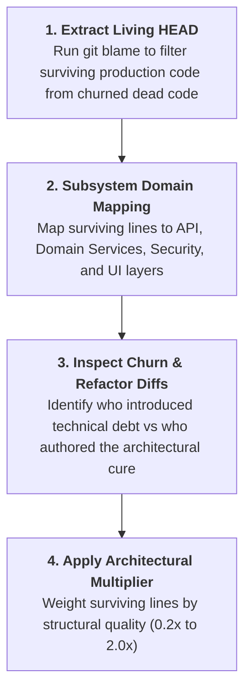

# Technical Debt Lifecycle & Code Forensics Playbook
*Differentiating Enterprise Asset Creation from High-Liability Architectural Churn*

> **Core Axiom:** Commit volume and raw lines of code added are vanity metrics. In early-stage startups, adding 1,000 lines of brittle code that creates 50 regression bugs and fails security scans is a net enterprise liability, not a contribution.

---

## 1. The Startup Engineering Paradox: Velocity vs. Fragility

Early-stage technology ventures operate under extreme pressure to demonstrate visual progress. However, an uncalibrated focus on shipping speed frequently introduces systemic structural rot:

```
 [ PHASE 1: FRAGILE VELOCITY ]        [ PHASE 2: SYSTEMIC CHURN ]        [ PHASE 3: ARCHITECTURAL RESCUE ]
 * Direct DB queries in UI hooks       * Regressions on every deploy      * Systematic decoupling to services
 * Hardcoded mock values in JSX        * Tenant isolation bypassed        * Automated test harness (200+ tests)
 * Client-side unauthenticated tokens  * Auditors/investors flag debt     * Strict default-deny security gates
       (NET LIABILITY)                     (MOMENTUM STALLS)                     (ENTERPRISE VALUE)
```

### 1.1 The Three Archetypes of Engineering Output

| Contributor Archetype | Observable Behavior in Git Forensics | Net Impact on Cap Table Value |
| :--- | :--- | :--- |
| **The Visual Prototyper** | High commit count; writes visual JSX rapidly; hardcodes database queries inside UI components; defers tests, error handling, and security gates. | **High Initial Drag:** Creates immediate visual progress for sales demos, but leaves behind massive technical debt that blocks production launch. |
| **The Architectural Anchor** | Refactors fragile stubs into decoupled domain services; introduces strict TypeScript schemas; writes comprehensive unit/integration test suites; enforces multi-tenant boundaries. | **Massive Force Multiplier:** Eliminates production outages; enables junior engineers to ship safely; passes institutional diligence. |
| **The SRE / Security Hardener** | Implements automated CI/CD guardrails; deploys Infrastructure-as-Code (Terraform); seals API boundaries; removes public storage leaks. | **Existential Shield:** Prevents statutory fines, regulatory shutdowns, and catastrophic customer data leaks. |

---

## 2. Common Early-Stage Technical Anti-Patterns (The Debt Ledger)

When conducting forensic code quality audits on early-stage codebases, four catastrophic anti-patterns routinely emerge:

### Anti-Pattern 1: Direct Database Coupling in Presentation Layers
* **The Symptom:** React components or UI controllers directly import database SDKs (e.g., Firestore `getDocs()`, Supabase client, Prisma query builder) inside component lifecycle hooks.
* **Why It Is Toxic:**
  1. **Bypasses Tenant Isolation:** Business logic and authorization checks are scattered across hundreds of files instead of centralized at a secured API boundary.
  2. **Untestable Code:** UI components cannot be unit-tested without connecting to a live cloud database.
  3. **Schema Lock-In:** A single database column rename requires editing dozens of React files.
* **The Venture-Grade Remedy:** Decouple all data access into a dedicated **Domain Service Layer** (`src/services/` or `app/domain/`) with centralized REST/gRPC endpoints and mockable interfaces.

### Anti-Pattern 2: Hardcoded UI Stubs Masquerading as Working Features
* **The Symptom:** Displaying static strings, mock calculations, or simulated readiness badges inside JSX to pass investor demos without connecting to backend truth.
  ```tsx
  // FRAGILE STUB (False Sense of Progress):
  <span className="badge">Fire Drill: Due in 5 days</span>
  <span className="metric">Compliance: 94.2%</span>
  ```
* **Why It Is Toxic:** Misleads co-founders and investors regarding real product readiness. When users interact with the tile, workflows break or fail silently.
* **The Venture-Grade Remedy:** Strip hardcoded mock text; wire components directly to calculated database metrics or state-machine resolvers; index audit tables for real-time telemetry.

### Anti-Pattern 3: Opt-Out / Default-Allow Security Gating
* **The Symptom:** New features, forms, or data routes are accessible to all tenants by default unless explicitly added to a blacklist array (`disabledTenants = ['agency-123']`).
* **Why It Is Toxic:** In multi-tenant B2B environments, adding a customer or feature inevitably leaks cross-tenant data whenever a developer forgets to update the blacklist.
* **The Venture-Grade Remedy:** Enforce **Default-Deny Architecture**. Every query must resolve through an explicit, whitelist-driven tenant resolver:
  $$\text{Access Granted} \iff \text{TenantID}(\text{User}) == \text{TenantID}(\text{Resource}) \land \text{IsApproved}(\text{Feature})$$

### Anti-Pattern 4: Capability URLs & Long-Lived Public Artifact Tokens
* **The Symptom:** Serving private PDFs, invoices, medical records, or user exports via public storage download tokens (`?token=...`) or signed URLs.
* **Why It Is Toxic:** Storage tokens are bearer credentials. Anyone with access to browser history, proxy logs, or forwarded emails gains permanent, unauthenticated access to confidential records, completely bypassing database rules.
* **The Venture-Grade Remedy:** Serve sensitive artifacts exclusively through an **authenticated, audited server stream** that verifies caller identity and emits a record to `audit_logs` upon every single read.

---

## 3. The Forensic Git Audit Methodology

To objectively evaluate engineering impact during founder calibrations and board reviews, execute the **Forensic Debt & Impact Audit**:



### 3.1 The Three Core Forensic Metrics
1. **Surviving Lines of Code in HEAD:**
   $$\text{Living Footprint} = \text{Count of lines currently running in production authored by Founder } X$$
2. **The Refactoring Survival Ratio:**
   $$\text{Survival Ratio} = \frac{\text{Surviving Lines in HEAD}}{\text{Gross Historical Lines Added}} \times 100\%$$
   * $> 50\%$: Highly durable, methodical architecture.
   * $< 20\%$: High-churn exploratory thrashing or discarded prototype debt.
3. **Debt Remediation Velocity:**
   The volume of fragile, coupled, or unauthenticated code authored by others that a founder systematically refactored, tested, and secured into production readiness.

---

## 4. The Architectural Quality Multiplier Table

When calculating calibrated founder contribution, apply the standard multiplier across surviving code footprints:

| Code Quality Tier | Multiplier | Behavioral & Architectural Profile |
| :--- | :---: | :--- |
| **Tier 1: Architectural Foundation** | **$1.5\times - 2.0\times$** | Clean Domain Service layers, central API routing, automated CI/CD scanners, multi-tenant isolation, default-deny rules, $>80\%$ test coverage. |
| **Tier 2: Robust Feature Engineering** | **$1.0\times - 1.2\times$** | Production-ready business workflows, typed schemas, clean UI integration with domain services, comprehensive error handling. |
| **Tier 3: Raw Component Presentation** | **$0.6\times - 0.8\times$** | Visual UI pages and layouts that rely on existing service layers; basic form submissions and CSS styling. |
| **Tier 4: Coupled Technical Debt** | **$0.2\times - 0.4\times$** | Direct DB queries in React hooks, hardcoded static values in JSX, missing test coverage, capability URL token exposures requiring senior rewrite. |

---

## 5. Summary: Elevating Founder Accountability

Startups do not succeed on good intentions. By applying rigorous code quality forensics, founding teams eliminate emotional debates over "who works harder" and ground their equity calibrations in **durable enterprise assets that survive diligence, delight customers, and scale reliably**.
