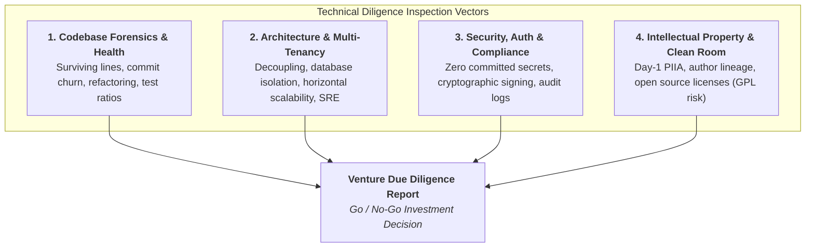

# VC Technical Due Diligence Playbook
### What Venture Capitalists, CTO Advisors, and Technical Diligence Partners Inspect Before Writing a Check

> **"In the seed stage, investors evaluate the founders. In Series A, they evaluate the metrics. In technical diligence, they verify whether the product is an enterprise fortress or a house of cards."**  
> — Partner, Enterprise Venture Fund

---

## 1. The Anatomy of Technical Diligence

When institutional venture funds or corporate acquirers conduct technical diligence on early-stage startups, they do not just read pitch decks or watch polished demo recordings. They conduct a rigorous, forensic inspection across **four core dimensions**:



---

## 2. Codebase Forensics: Activity vs. Surviving Reality

Savvy diligence reviewers look past superficial vanity metrics like "1,000 GitHub commits" or "50,000 lines added." Instead, they evaluate **Git Telemetry**:

### 2.1 Surviving Lines of Code (Blame Footprint)
* **What They Look For:** How many lines of code currently active in the production `HEAD` were authored by the core founders?
* **Red Flag:** High commit volume accompanied by high line deletion (churn > 80%). This indicates erratic experimentation, brittle copy-pasting, or inability to produce stable architecture.
* **Green Flag:** High surviving code ratio (> 65%) with clean, disciplined commits, clear PR descriptions, and rigorous code reviews.

### 2.2 The Bus Factor & Single-Point Failure
* **The Question:** If the lead technical founder is hit by a bus tomorrow, does the company survive?
* **Red Flag:** A codebase where 100% of the architecture is known only to one person, with zero documentation, missing architectural RFCs, and obscure deployment scripts.
* **Green Flag:** Clear documentation (`docs/architecture.md`), modular code boundaries, self-describing APIs, and automated CI/CD deployment pipelines.

### 2.3 Automated Test Coverage & Engineering Discipline
* **The Ratio:** Does the engineering team test their code, or do paying customers test it in production?
* **Expectation:** Unit test coverage for core business logic, automated integration test suites running on every pull request, and zero merge without passing CI checks.

---

## 3. Architecture & Infrastructure Audit

```
┌────────────────────────────────────────────────────────────────────────┐
│                   VC ARCHITECTURE HEALTH SCORECARD                     │
├──────────────────────┬────────────────────────┬────────────────────────┤
│ CATEGORY             │ CRITICAL FAILURE (RED) │ VENTURE GRADE (GREEN)  │
├──────────────────────┼────────────────────────┼────────────────────────┤
│ Tenancy & Isolation  │ Shared collections with│ Tenant-scoped queries, │
│                      │ missing WHERE clauses; │ strict RBAC at gateway,│
│                      │ risk of data leakage.  │ database-level rules.  │
├──────────────────────┼────────────────────────┼────────────────────────┤
│ Secrets Management   │ API keys committed in  │ GCP Secret Manager /   │
│                      │ git, .env files, or    │ Vault; zero plaintext  │
│                      │ client-side bundles.   │ keys; KMS HSM signing. │
├──────────────────────┼────────────────────────┼────────────────────────┤
│ Ingress & SRE        │ Unauthenticated HTTP;  │ Cloud Armor / WAF;     │
│                      │ wildcard CORS; no rate │ HSTS; pinned CORS;     │
│                      │ limiting or DDoS guard.│ automatic auto-scale.  │
├──────────────────────┼────────────────────────┼────────────────────────┤
│ Audit Logging        │ Zero access logs or    │ Append-only immutable  │
│                      │ unredacted PHI/PII in  │ audit logs; structured │
│                      │ plaintext console logs.│ JSON; zero logged PII. │
└──────────────────────┴────────────────────────┴────────────────────────┘
```

---

## 4. Intellectual Property (IP) & Clean Room Audit

One of the most common reasons deals stall in legal diligence is **tainted intellectual property**:

1. **The Day-1 PIIA Requirement:** Every founder, contractor, and intern who ever touched the code must have a signed **Proprietary Information and Inventions Agreement** assigning all rights to the corporate entity.
2. **Prior Employer Contamination:** Did a founder write startup code on a corporate laptop from their former employer (Google, Meta, Amazon, or a hospital system)? If yes, the former employer may legally own the startup's code!
3. **Copyleft License Toxicity (GPL / AGPL):**
   * Incorporating libraries under **GNU General Public License (GPL)** or **Affero GPL (AGPL)** can legally obligate your company to open-source its proprietary commercial code.
   * Diligence teams run automated software composition analysis (SCA) like FOSSA, Snyk, or Trivy to identify tainted dependencies.

---

## 5. Technical Diligence Preparation Checklist
- [ ] Ensure all code repositories reside in an official corporate GitHub/GitLab organization (not personal user accounts).
- [ ] Confirm 100% of contributors have signed corporate PIIA agreements on file.
- [ ] Run automated dependency and vulnerability scans (`npm audit`, Snyk, Trivy). Zero Critical or High vulnerabilities allowed.
- [ ] Purge any historical secrets or keys from Git history using `git-filter-repo` or BFG Repo-Cleaner.
- [ ] Maintain an up-to-date **System Architecture Diagram** in repository documentation.
- [ ] Document all external SaaS dependencies, cloud providers, and monthly infrastructure burn.
- [ ] Prepare an automated deployment demo: show code merging via PR, passing automated CI tests, and deploying seamlessly to staging/production.
