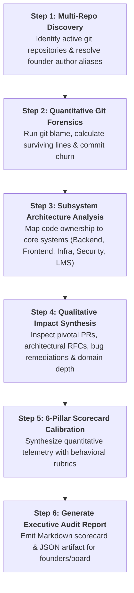

# Founder Contribution & Codebase Audit Skill

This skill equips AI coding agents with the methodologies, Git forensic commands, and analytical frameworks required to evaluate founder contributions, codebase ownership, and equity alignment across one or more software repositories.

---

## When to Activate This Skill
Activate this skill whenever a founder, CTO, or venture investor requests:
* An audit of founder contributions, code quality, or engineering activity across repositories.
* Calculation of surviving lines of code, author attribution, or commit churn.
* Objective evaluation of co-founder performance against the **6 Pillars of Foundership**.
* Preparation of materials for a **Quarterly Founder Calibration Review (FCR)** or equity dispute mediation.
* Technical due diligence preparation for an institutional fundraising round.

---

## Core Operational Workflow



---

## Step 1: Repository Discovery & Identity Resolution

### 1.1 Discovering Active Repositories
Identify all local Git repositories in the workspace or parent directory:
```bash
# Locate all git root directories
git rev-parse --show-toplevel
```

### 1.2 Resolving Author Aliases
Founders frequently commit under multiple names, personal emails, or machine hostnames. Construct an alias map before running calculations:
```bash
# Extract all distinct author names and emails
git log --format='%aN <%aE>' | sort -u
```
Map all variations to the canonical founder name:
```json
{
  "Founder A": ["fa@startup.io", "fa-personal@gmail.com", "fa-macbook"],
  "Founder B": ["fb@startup.io", "founder-b-dev"],
  "Founder C": ["fc@startup.io", "fc-personal@yahoo.com"]
}
```

---

## Step 2: Quantitative Git Telemetry Extraction

### 2.1 Surviving Lines of Code (The Gold Standard)
Do **not** rely on raw commit logs or `git log --stat` (which can be heavily inflated by copy-pasting, churn, or generated files). Measure **living lines in the current `HEAD`**:

```bash
# Run git blame across non-ignored, tracked production files
git ls-files -- '*.ts' '*.tsx' '*.go' '*.py' '*.rs' '*.java' '*.sql' | xargs -n 1 git blame --line-porcelain | grep '^author ' | sort | uniq -c | sort -nr
```

**Filter Rules:**
* **Exclude:** `package-lock.json`, `pnpm-lock.yaml`, `vendor/`, `node_modules/`, generated SDKs, build artifacts, minified bundles, and third-party vendor assets.
* **Include:** Production source code, API routes, database schemas, security rules, and test suites.

### 2.2 Commit Churn & Longevity Ratio
Calculate whether an author writes enduring code or churns excessively:
$$\text{Survival Ratio} = \frac{\text{Surviving Lines in HEAD}}{\text{Gross Lines Added in History}} \times 100\%$$

* **High Ratio ($> 50\%$):** Methodical, enduring architecture.
* **Low Ratio ($< 20\%$):** High churn, experimental thrashing, or abandoned prototypes.

### 2.3 Temporal Consistency (Active Days)
Evaluate sustained commitment over time:
```bash
# Count active contribution days per author
git log --author="Author Name" --format='%ad' --date=short | sort -u | wc -l
```

---

## Step 3: Subsystem & Single-Threaded Ownership (STO) Mapping

Categorize code ownership by functional subsystem:
1. **Security & Identity Gateway:** Authentication, JWT/JWKS token verification, KMS cryptographic signing, RBAC middleware.
2. **Core Data Engine & Schemas:** Database definitions, multi-tenant partition logic, Firestore/Postgres access rules.
3. **Clinical / Domain Workflows:** Forms engine, specialized state reporting, workflow state machines.
4. **Platform & Infrastructure (SRE):** Dockerfiles, CI/CD GitHub Actions, Terraform IaC, logging sinks, Secret Manager.
5. **Automated Test Suites:** Unit tests, integration tests, end-to-end harnesses.

For each subsystem, determine the **Primary Author** ($> 50\%$ living code) and evaluate whether **Single-Threaded Ownership** is preserved.

---

## Step 4: Qualitative Impact Synthesis

Examine the non-numeric dimensions that distinguish a visionary founder from an employee engineer:
* **The "100% Finisher" Test:** Did the founder take the feature from prototype to production—including error boundaries, automated tests, security scans, and operational runbooks?
* **Zero-to-One Inertia:** Did this founder initiate the repository, build the initial prototype solo, and establish legal and cloud infrastructure?
* **Bar-Raising Standards:** Does the founder's code elevate the team's patterns, or does it introduce technical debt that others must constantly refactor?
* **Commercial Scoping:** Does the code solve real customer problems that drive revenue and pilot conversion?

---

## Step 5: Scoring Against the 6 Pillars of Foundership

Synthesize findings into the **Universal Founder Contribution Scorecard**:

| Foundational Pillar | Target Evidence & Telemetry | Weight (Stage 1) | Weight (Stage 2) | Weight (Stage 3) |
| :--- | :--- | :---: | :---: | :---: |
| **1. Vision & Strategy** | Architectural RFCs, product roadmap, moat defensibility | 20% | 15% | 20% |
| **2. Technical Mastery** | System boundaries, multi-tenancy, security posture | 20% | 20% | 15% |
| **3. The 100% Finisher** | Surviving code %, edge cases closed, test coverage | 30% | 25% | 15% |
| **4. Bias for Action** | Solo prototype velocity, unblocking speed, STO execution | 20% | 15% | 10% |
| **5. Force Multiplier** | PR reviews, team mentorship, culture and bar raising | 5% | 10% | 20% |
| **6. Commercial Scoping** | Customer pilot conversion, capital efficiency, burn control | 5% | 15% | 20% |

---

## Step 6: Executing the Automated Audit Tool

When available, run the bundled zero-dependency Python tool in the repository:
```bash
python tools/founder_audit.py --repos /path/to/repo1 /path/to/repo2 --output report.md --json report.json
```

Or pass a configuration file:
```bash
python tools/founder_audit.py --config tools/founder-audit.config.example.json
```

---

## Output Contract

When an AI agent executes this skill, it must produce:
1. **Executive Summary:** High-level narrative of founding contributions, surviving lines distribution, and ownership balance.
2. **Quantitative Telemetry Table:** Breakdown of surviving lines, percentage of living codebase, active days, and commit volume per founder.
3. **Subsystem Ownership Matrix:** Table mapping key subsystems to their Single-Threaded Owner ($A$).
4. **Pillar Scorecard & Composite Rating:** 1–10 score per pillar with specific git commit and PR evidence.
5. **Strategic Recommendations:** Actionable guidance for cap table calibration, milestone tranche sign-offs, and operational unblocking.
