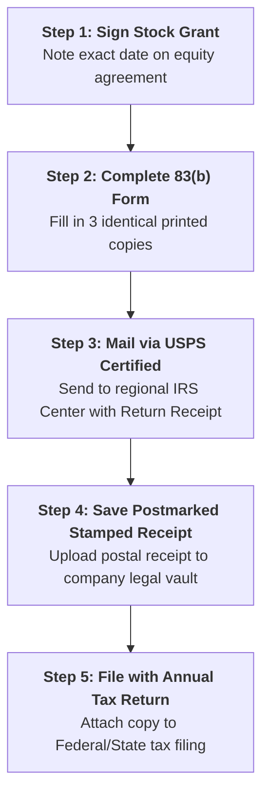

# IRS Section 83(b) Election Package & Filing Guide
### Statutory Tax Election Form, Cover Letter, and 30-Day Hard-Deadline Checklist

> **CRITICAL LEGAL NOTICE:**  
> This election must be filed with the IRS **within exactly 30 calendar days** from the date your unvested shares are granted.  
> **The IRS has ZERO discretion to grant extensions.** If you miss day 30, the election is invalid, which can trigger massive tax penalties as your company valuation grows.

---

## 1. The 30-Day Step-by-Step Filing Workflow



---

## 2. Model Section 83(b) Election Form

```text
ELECTION PURSUANT TO SECTION 83(b) OF THE INTERNAL REVENUE CODE

The undersigned taxpayer hereby makes an election under Section 83(b) of the Internal Revenue Code of 1986, as amended, to include in gross income for the taxable year the excess of the fair market value of the property transferred over the amount paid for such property:

1. Taxpayer Name: __________________________________________________________________
   Social Security Number: [XXX-XX-XXXX]
   Address: ________________________________________________________________________

2. Description of Property:
   [Number of Shares, e.g., 3,000,000] shares of Common Stock / Units of:
   Company Name: [Company Name, Inc. / LLC]
   State of Organization: [e.g. Delaware / New Hampshire]

3. Date of Transfer:
   The date on which the property was transferred to the taxpayer: [Date, e.g., March 1, 2026]
   Taxable Year for which Election is Made: Calendar Year 2026

4. Restrictions to which Property is Subject:
   The shares are subject to vesting and repurchase options in favor of the Company upon cessation of taxpayer's services to the Company pursuant to a Restricted Stock Agreement.

5. Fair Market Value:
   The fair market value of the property at the time of transfer (determined without regard to any restrictions other than non-lapse restrictions):
   $0.0001 per share; Total Fair Market Value: $[e.g., $300.00]

6. Amount Paid for Property:
   The amount paid by the taxpayer for the property:
   $0.0001 per share; Total Amount Paid: $[e.g., $300.00]

7. Amount to Include in Gross Income:
   The amount to include in gross income under Section 83(b) (Item 5 minus Item 6):
   $0.00

8. Copy of Election Provided to Company:
   A copy of this election has been submitted to the Secretary of the Company.

Dated: ____________________, 20____


________________________________________________
Taxpayer Signature

________________________________________________
Printed Name
```

---

## 3. IRS Cover Letter (Print on Letterhead / Personal Paper)

```text
[Date]

VIA USPS CERTIFIED MAIL
RETURN RECEIPT REQUESTED

Internal Revenue Service Center
[Insert address of regional IRS Center where you file personal Form 1040]

Re: Election Under Section 83(b) of the Internal Revenue Code
    Taxpayer: [Your Full Legal Name]
    SSN: [XXX-XX-XXXX]

Dear Sir or Madam:

Enclosed please find an original and one copy of an Election under Section 83(b) of the Internal Revenue Code of 1986, as amended, executed by the above-referenced taxpayer.

Please acknowledge receipt of this filing by stamping the enclosed copy of this letter and the copy of the Section 83(b) Election with the date of receipt and returning them in the self-addressed, stamped envelope provided herewith.

Respectfully submitted,


________________________________________________
Taxpayer Signature

Enclosures:
1. Section 83(b) Election (Original)
2. Section 83(b) Election (Copy to be stamped and returned)
3. Self-Addressed, Stamped Envelope
```

---

## 4. IRS Filing Center Addresses (For Individual Form 1040 filers)

Check the latest IRS instructions for Form 1040 for your state of residence. Common centers:
* **Austin, TX:** Internal Revenue Service, Austin, TX 73301-0002
* **Kansas City, MO:** Internal Revenue Service, Kansas City, MO 64999-0002
* **Ogden, UT:** Internal Revenue Service, Ogden, UT 84201-0002

*(Always send via USPS Certified Mail with Return Receipt Requested. Private couriers like FedEx/UPS often cannot deliver to IRS PO Box addresses).*
